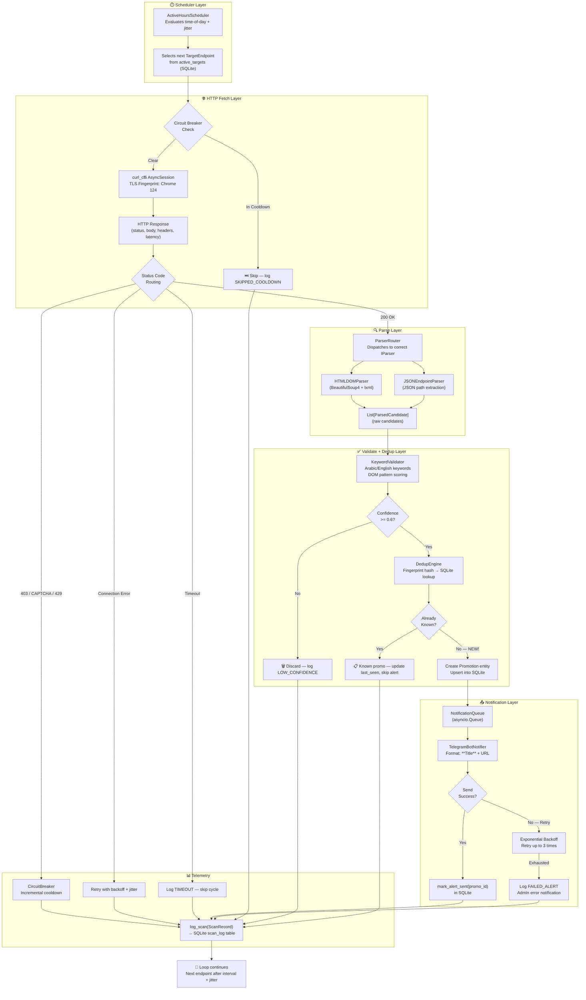

# Amazon Egypt Promo Monitor (Amz-Hunt) — Architecture Blueprint

> **Status:** Authoritative Architectural Reference  
> **Version:** 1.0.0  
> **Stack:** Python 3.11+ / `curl_cffi` / `asyncio` / SQLite / BeautifulSoup4  
> **Budget:** $0 (Zero-Cost — stdlib + MIT/Apache2-licensed libraries only)  
> **Target:** Amazon Egypt (`amazon.eg`) — Promotional Landing Page Detection

---

## Table of Contents

1. [System Design Pattern & Decoupling](#1-system-design-pattern--decoupling)
2. [Core Logic Entities & State](#2-core-logic-entities--state)
3. [Data Flow & Pipeline](#3-data-flow--pipeline)
4. [Scalable Directory Structure](#4-scalable-directory-structure)
5. [Advanced Error Handling & Security Strategy](#5-advanced-error-handling--security-strategy)
6. [Appendix: Dependency Inventory](#6-appendix-dependency-inventory)

---

## 1. System Design Pattern & Decoupling

### 1.1 Architectural Pattern: Hexagonal (Ports & Adapters) over Modular Monolith

We adopt a **Hexagonal Architecture** (a.k.a. Ports & Adapters) layered over a **Modular Monolith** runtime. This pattern was chosen for three reasons:

| Reason | Explanation |
|--------|-------------|
| **Zero-budget constraint** | We cannot afford distributed microservices, message brokers, or separate databases. Everything runs in a single Python process. The Hexagonal pattern gives us *microservice-level decoupling inside a monolith* — every external dependency is replaceable without touching core logic. |
| **Amazon anti-bot arms race** | Our HTTP client (`curl_cffi`) may need to be swapped for a different TLS library in the future. Telegram could be replaced with Discord, Slack, or email. SQLite could become PostgreSQL if we ever get funding. Hexagonal architecture makes these swaps *single-file changes*. |
| **Testability** | Every external boundary (HTTP, DB, Notification) is behind an interface/abstract base class. Unit tests mock these interfaces; integration tests swap in real adapters. No test ever hits Amazon or Telegram unexpectedly. |

### 1.2 Port Definitions (Abstract Interfaces)

Each "Port" is a Python **Protocol** (structural subtyping, `typing.Protocol`) or **Abstract Base Class** (`abc.ABC`). Protocols are preferred for zero-runtime-overhead structural typing; ABCs are used when shared concrete logic exists.

#### Port 1: `IHttpClient`

```python
# src/core/ports/http_client.py
from typing import Protocol, runtime_checkable
from src.core.models import HttpResponse

@runtime_checkable
class IHttpClient(Protocol):
    """Abstract contract for HTTP fetching with TLS fingerprint impersonation."""

    async def fetch(
        self,
        url: str,
        headers: dict[str, str] | None = None,
        impersonate: str = "chrome124",
        timeout: int = 30,
    ) -> HttpResponse:
        """
        Fetch a URL with browser TLS fingerprint impersonation.

        Args:
            url: Target URL to fetch.
            headers: Optional custom headers (merged with session defaults).
            impersonate: TLS fingerprint profile (e.g., 'chrome124', 'chrome120', 'firefox120').
            timeout: Request timeout in seconds.

        Returns:
            HttpResponse(status_code, body, headers, final_url) — always a value object,
            never raises for HTTP-level errors (4xx, 5xx). Network/timeout errors raise
            HttpClientError (defined below).

        Raises:
            HttpClientError: On connection failure, DNS error, or TLS handshake failure.
        """
        ...

    async def rotate_fingerprint(self) -> str:
        """Cycle to the next TLS impersonation profile and return its identifier."""
        ...

    def session_metrics(self) -> dict[str, int]:
        """Return (total_requests, blocked_requests, success_requests, avg_latency_ms)."""
        ...
```

**Concrete Adapter:** `src/adapters/http/curl_cffi_client.py` — implements `IHttpClient` via `curl_cffi.requests.AsyncSession`, impersonating Chrome 124 (default), with configurable fingerprint rotation.

> **Why `curl_cffi` is non-negotiable:** Amazon's WAF (Web Application Firewall) inspects the TLS ClientHello, specifically the **JA3/JA4 fingerprint**. Standard Python `requests` (which wraps `urllib3`/OpenSSL) broadcasts a distinct Python TLS fingerprint that Amazon flags instantly. `curl_cffi` patches `libcurl` at the C level to exactly replicate Chrome/Firefox TLS handshakes — the single most critical anti-detection mechanism in our stack. No Node.js library currently matches this capability.

#### Port 2: `IStorageBackend`

```python
# src/core/ports/storage.py
from typing import Protocol, runtime_checkable
from src.core.models import Promotion, TargetEndpoint, ScanRecord

@runtime_checkable
class IStorageBackend(Protocol):
    """Abstract contract for persistent state storage."""

    # --- Promotion CRUD ---
    async def upsert_promotion(self, promo: Promotion) -> bool:
        """Insert or update a promotion. Returns True if NEW (not previously seen)."""
        ...

    async def mark_alert_sent(self, promo_id: str) -> None:
        """Set alert_sent=1 for a given promotion ID."""
        ...

    async def was_alert_sent(self, promo_id: str) -> bool:
        """Check if alert was already sent for this promotion ID."""
        ...

    async def get_promotion_by_fingerprint(self, fingerprint: str) -> Promotion | None:
        """Look up a promotion by its content fingerprint hash."""
        ...

    # --- Target Endpoint CRUD ---
    async def get_active_targets(self) -> list[TargetEndpoint]:
        """Retrieve all target endpoints currently enabled for polling."""
        ...

    async def update_last_polled(self, endpoint_id: str, timestamp: float) -> None:
        """Record that an endpoint was polled at the given Unix timestamp."""
        ...

    async def record_failure(self, endpoint_id: str) -> int:
        """Increment consecutive_failures counter. Returns new count."""
        ...

    async def reset_failures(self, endpoint_id: str) -> None:
        """Reset consecutive_failures to zero (e.g., on successful poll)."""
        ...

    # --- Scan Logging ---
    async def log_scan(self, record: ScanRecord) -> None:
        """Append a scan record for telemetry/debugging."""
        ...

    async def get_recent_scan_stats(self, hours: int = 24) -> dict:
        """Return aggregated scan stats for the last N hours."""
        ...
```

**Concrete Adapter:** `src/adapters/storage/sqlite_backend.py` — implements `IStorageBackend` via `aiosqlite` (async wrapper around stdlib `sqlite3`). Single-file database at `data/amz_hunt.db`.

> **Why async SQLite via `aiosqlite`:** Our main loop is `asyncio`-based. Blocking the event loop with synchronous `sqlite3` calls would stall all concurrent polls. `aiosqlite` lets DB operations yield to the event loop. If we ever need PostgreSQL, we swap this one adapter file — zero core changes.

#### Port 3: `INotificationService`

```python
# src/core/ports/notification.py
from typing import Protocol, runtime_checkable
from src.core.models import Promotion, NotificationResult

@runtime_checkable
class INotificationService(Protocol):
    """Abstract contract for sending alerts to external channels."""

    async def send_promo_alert(self, promo: Promotion) -> NotificationResult:
        """
        Send a single promotion alert.

        Returns NotificationResult(success: bool, channel: str, message_id: str | None, error: str | None).
        Implementations must be idempotent-safe: calling twice for the same promo should not
        double-deliver (though the dedup engine should prevent this at the orchestration layer).
        """
        ...

    async def send_health_check(self, status: dict) -> NotificationResult:
        """Send system health/heartbeat metrics (optional, for debugging)."""
        ...

    async def send_error_alert(self, message: str, severity: str) -> NotificationResult:
        """Notify administrators of critical failures (circuit-breaker trips, prolonged blocks)."""
        ...
```

**Concrete Adapter:** `src/adapters/notification/telegram_bot.py` — implements `INotificationService` via Telegram Bot API HTTP calls (using the same `curl_cffi` session for consistency). Messages formatted as clean Markdown: `**[Promo Title]** [Direct URL]`.

> **Swap path to Discord:** Write `src/adapters/notification/discord_webhook.py` implementing the same Protocol. Change one line in the DI container. Done.

#### Port 4: `IParser`

```python
# src/core/ports/parser.py
from typing import Protocol, runtime_checkable
from src.core.models import HttpResponse, ParsedCandidate

@runtime_checkable
class IParser(Protocol):
    """Abstract contract for extracting promotion candidates from HTTP responses."""

    @property
    def parser_type(self) -> str:
        """Identifier: 'html_dom', 'json_endpoint', 'xml_feed'."""
        ...

    async def extract_candidates(self, response: HttpResponse) -> list[ParsedCandidate]:
        """
        Parse an HTTP response and return zero or more promotion candidates.

        Returns empty list if no recognizable promotions found.
        Must NOT raise for parse failures — return empty list + log warning.
        """
        ...
```

**Concrete Adapters (Strategy Pattern):**
- `src/adapters/parsers/html_dom_parser.py` — BeautifulSoup4 + lxml, scans for promo-specific DOM patterns (`.deals-badge`, `[data-promo-id]`, text nodes containing keywords).
- `src/adapters/parsers/json_endpoint_parser.py` — Parses Amazon's internal AJAX JSON responses (e.g., `/gp/aj/some-endpoint`), extracting promo ID/title fields.

### 1.3 Dependency Injection Container

```python
# src/core/di_container.py (conceptual)
#
# A lightweight manual DI container (no framework needed at $0 budget).
# At startup, assembles:
#   http_client   = CurlCffiClient(config)
#   storage       = SQLiteBackend("data/amz_hunt.db")
#   notification  = TelegramBotNotifier(config.telegram_bot_token, config.telegram_chat_id)
#   parser_router = ParserRouter({html: HTMLDOMParser(), json: JSONEndpointParser()})
#   orchestrator  = ScanOrchestrator(http=http_client, storage=storage,
#                                     notifier=notification, parsers=parser_router)
#
# The orchestrator ONLY depends on IHttpClient, IStorageBackend, INotificationService, IParser.
# It never imports concrete adapter modules directly.
```

### 1.4 Decoupling Diagram

```
┌─────────────────────────────────────────────────────────────┐
│                      CORE LOGIC LAYER                       │
│                                                             │
│  ┌──────────────┐  ┌──────────────┐  ┌──────────────────┐   │
│  │ScanOrchestrator│  │ DedupEngine  │  │ ActiveHoursSched │   │
│  └───────┬──────┘  └──────┬───────┘  └────────┬─────────┘   │
│          │                │                    │             │
│  ┌───────▼────────────────▼────────────────────▼─────────┐  │
│  │              PORT INTERFACES (Protocols)              │  │
│  │  IHttpClient │ IStorageBackend │ INotificationService │  │
│  │  IParser     │                  │                     │  │
│  └───────▲──────▲──────────────────▲─────────────────────┘  │
└──────────┼──────┼──────────────────┼────────────────────────┘
           │      │                  │
┌──────────┼──────┼──────────────────┼────────────────────────┐
│          │      │     ADAPTER LAYER                         │
│  ┌───────┴──────┴──────────────────┴─────────────────────┐  │
│  │  curl_cffi_client  │  sqlite_backend  │  telegram_bot │  │
│  │  html_dom_parser   │  json_endpoint_parser            │  │
│  └────────────────────┴──────────────────┴───────────────┘  │
└─────────────────────────────────────────────────────────────┘
```

**Dependency Rule:** Arrows point INWARD. Core knows nothing about adapters. Adapters import core interfaces and implement them. The DI container (composition root) is the ONLY module that imports both core AND adapters.

---

## 2. Core Logic Entities & State

### 2.1 Entity Catalog

All entities are defined as **immutable (frozen) dataclasses** where possible, or **plain dataclasses** with controlled mutability for state-tracking fields. Immutability prevents accidental mutation during async pipeline stages.

```python
# ── src/core/models/promotion.py ──

from dataclasses import dataclass, field
import hashlib

@dataclass(frozen=True, slots=True)
class Promotion:
    """
    A detected Amazon Egypt promotion.
    Frozen (immutable) — once created, identity is fixed.
    Equality is based on promo_id only.
    """
    promo_id: str               # Unique identifier parsed from Amazon (e.g., data-promo-id="XYZ-123")
    url: str                    # Direct landing page URL
    title: str                  # Extracted promo title (Arabic/English)
    content_fingerprint: str    # SHA256 of extracted promo-relevant DOM subtree (for dedup)
    first_seen_utc: float       # Unix timestamp of first discovery
    source_endpoint_id: str     # Which TargetEndpoint produced this discovery

    # DB-persisted mutable state (stored separately, not in the frozen entity)
    # alert_sent: bool          # Managed via IStorageBackend.mark_alert_sent()

    @staticmethod
    def compute_fingerprint(raw_html_snippet: str) -> str:
        """SHA256 hash of the normalized HTML snippet representing this promo."""
        normalized = raw_html_snippet.strip().lower()
        return hashlib.sha256(normalized.encode("utf-8")).hexdigest()
```

```python
# ── src/core/models/target_endpoint.py ──

from dataclasses import dataclass, field

@dataclass(slots=True)
class TargetEndpoint:
    """
    A curated polling target — an Amazon Egypt URL or AJAX endpoint known to host promotions.

    NOT frozen because we mutate polling state (last_polled, consecutive_failures).
    """
    endpoint_id: str                      # UUID or short slug (e.g., "deals-hub-main")
    url: str                              # Full URL to poll
    parser_type: str                      # "html_dom" | "json_endpoint"
    poll_interval_seconds: int = 60       # Base interval (jitter applied separately)
    active_hours: tuple[int, int] = (8, 2)  # (start_hour_utc, end_hour_utc) — 8 AM to 2 AM Cairo = UTC+2
    impersonate_profile: str = "chrome124"  # TLS fingerprint profile for this endpoint
    priority: int = 1                     # Lower = higher priority (1=critical, 5=low)

    # Mutable state (managed by orchestrator, persisted by IStorageBackend)
    last_polled_utc: float = 0.0
    consecutive_failures: int = 0
    circuit_breaker_until_utc: float = 0.0  # If > now, skip this endpoint entirely

    def is_in_cooldown(self, now_utc: float) -> bool:
        """True if circuit-breaker is active."""
        return now_utc < self.circuit_breaker_until_utc

    def cooldown_remaining_seconds(self, now_utc: float) -> float:
        """Seconds until cooldown expires (0 if not in cooldown)."""
        return max(0.0, self.circuit_breaker_until_utc - now_utc)
```

```python
# ── src/core/models/scan_result.py ──

from dataclasses import dataclass
from enum import Enum, auto

class ScanOutcome(Enum):
    SUCCESS_NEW_PROMO = auto()    # Found a never-before-seen promotion
    SUCCESS_NO_CHANGE = auto()    # Page loaded fine, no new promos
    BLOCKED_403 = auto()          # Amazon returned 403 Forbidden
    BLOCKED_CAPTCHA = auto()      # CAPTCHA challenge detected in response
    BLOCKED_THROTTLED = auto()    # 429 Too Many Requests or similar
    ERROR_CONNECTION = auto()     # Network error, DNS failure, TLS handshake failure
    ERROR_TIMEOUT = auto()        # Request exceeded timeout
    ERROR_PARSE = auto()          # Page loaded but parser could not extract structured data

@dataclass(frozen=True, slots=True)
class ScanResult:
    """
    Discriminated union: the outcome of one polling cycle for one TargetEndpoint.
    Immutable — a historical record of what happened.
    """
    endpoint_id: str
    outcome: ScanOutcome
    timestamp_utc: float
    new_promotions: tuple[Promotion, ...] = ()   # Empty unless SUCCESS_NEW_PROMO
    http_status_code: int | None = None
    error_message: str | None = None
    latency_ms: float | None = None
```

```python
# ── src/core/models/notification.py ──

from dataclasses import dataclass

@dataclass(frozen=True, slots=True)
class NotificationResult:
    """Result of a Telegram (or other channel) send attempt."""
    success: bool
    channel: str               # "telegram", "discord", etc.
    message_id: str | None     # Telegram message_id (for edit/delete later if needed)
    error: str | None
    timestamp_utc: float
```

```python
# ── src/core/models/http_models.py ──

from dataclasses import dataclass

@dataclass(frozen=True, slots=True)
class HttpResponse:
    """Value object representing an HTTP response."""
    status_code: int
    body: str                              # Raw response body (HTML or JSON text)
    headers: dict[str, str]                # Response headers (lowercased keys)
    final_url: str                         # After redirects
    latency_ms: float
    tls_fingerprint_used: str              # e.g., "chrome124"
```

```python
# ── src/core/models/parsed_candidate.py ──

from dataclasses import dataclass

@dataclass(frozen=True, slots=True)
class ParsedCandidate:
    """
    A promotion candidate extracted by a parser (BEFORE dedup/validation).
    May be a false positive — DedupEngine + Validator filter these.
    """
    candidate_id: str          # Parser-generated tentative ID (URL-derived)
    url: str
    raw_title: str
    content_snippet: str       # The DOM subtree or JSON snippet used for fingerprinting
    parser_name: str           # Which parser produced this (for debugging)
    confidence_score: float    # 0.0–1.0 heuristic score from keyword/element matching
    source_endpoint_id: str
```

### 2.2 State Preservation Across Continuous Scanning

The system operates as a **long-running `asyncio` event loop**. State is preserved across scan cycles through three mechanisms:

| Mechanism | Stores | Durability |
|-----------|--------|------------|
| **SQLite Database** (`data/amz_hunt.db`) | All `Promotion` records, `TargetEndpoint` mutable state (`last_polled_utc`, `consecutive_failures`, `circuit_breaker_until_utc`), `ScanRecord` telemetry | Survives process restart indefinitely |
| **In-Memory `asyncio.Queue`** | Pending `NotificationResult` items awaiting Telegram dispatch (decouples scanning from sending) | Lost on restart (acceptable — dedup DB prevents re-sending) |
| **DI Container Singleton State** | `curl_cffi` session pool (keep-alive connections), rotating header index, session metrics counters | Lost on restart (session recreated on boot, no data loss) |

**Safe Shutdown Sequence:**
1. SIGTERM/SIGINT received → signal handler sets `shutdown_flag` (an `asyncio.Event`).
2. Orchestrator finishes current in-flight poll (max 30 seconds) but stops scheduling new polls.
3. Notification queue drained (all pending alerts sent before exit, with 10-second drain timeout).
4. DB connection gracefully closed (`await db.close()`).
5. Session metrics logged one final time.

### 2.3 Keyword Validation Rules (Detection Criterion C)

The validator (`src/core/validator.py`) applies these heuristics to each `ParsedCandidate` before promoting it to a `Promotion`:

```python
# Conceptual — validation rule set

REQUIRED_ARABIC_KEYWORDS: list[str] = [
    "خصم",       # Discount
    "عرض",       # Offer
    "تخفيضات",   # Sale/Discounts
    "صفقة",      # Deal
    "كوبون",     # Coupon
    "توفير",     # Save
]

REQUIRED_ENGLISH_KEYWORDS: list[str] = [
    "deal",
    "coupon",
    "offer",
    "sale",
    "discount",
    "promo",
]

REQUIRED_DOM_PATTERNS: list[str] = [
    '[class*="dealBadge"]',
    '[class*="promoLabel"]',
    '[class*="couponBadge"]',
    '[data-promo-id]',        # Amazon's internal promo tracking attribute
    '[id*="deal"]',
    '[id*="promo"]',
]

# Validation logic:
#   confidence_score = 0.0
#   + 0.3 if ANY Arabic keyword in title or nearby text
#   + 0.3 if ANY English keyword in title or nearby text
#   + 0.4 if ANY DOM pattern matched
#   Candidate passes if confidence_score >= 0.6
```

---

## 3. Data Flow & Pipeline

### 3.1 End-to-End Pipeline Diagram (Mermaid)



### 3.2 Step-by-Step Pipeline Walkthrough

#### Phase 1: Scheduling & Target Selection

```python
# Conceptual — src/core/scheduler.py

async def select_next_target(
    storage: IStorageBackend,
    now_utc: float,
) -> TargetEndpoint | None:
    """
    1. Fetch all active targets from DB.
    2. Filter: skip if circuit_breaker_until_utc > now_utc.
    3. Filter: skip if outside active_hours window (with configurable strictness).
    4. Filter: skip if (now_utc - last_polled_utc) < (poll_interval + jitter).
    5. Sort by priority (ascending), then by staleness (oldest last_polled first).
    6. Return the top candidate, or None if all are ineligible.
    """
```

**Jitter Formula:**
```
effective_interval = poll_interval_seconds + random.uniform(-15, +15)
```
This means a 60-second base interval produces actual intervals between 45–75 seconds, making request patterns harder for Amazon's ML models to fingerprint.

**Active Hours Logic:**
```python
# Cairo is UTC+2 (EEST in summer, EET in winter). We configure in UTC internally.
# Example: active_hours = (6, 0) means 06:00 UTC to 00:00 UTC the next day.
#           This maps to 08:00–02:00 Cairo time (peak shopping hours).

def is_within_active_hours(now_utc: float, active_window: tuple[int, int]) -> bool:
    current_hour = datetime.utcfromtimestamp(now_utc).hour
    start, end = active_window
    if start <= end:
        return start <= current_hour <= end
    else:
        # Wraps around midnight (e.g., 22:00–06:00)
        return current_hour >= start or current_hour <= end
```

During inactive hours, the scheduler drops to a "slow scan" mode: polls every 5–10 minutes (configurable) instead of 60 seconds. This reduces Amazon WAF anomaly scoring during low-traffic periods.

#### Phase 2: HTTP Fetch with TLS Impersonation

```python
# Conceptual — src/core/orchestrator.py (fetch phase)

async def _fetch_endpoint(
    http: IHttpClient,
    endpoint: TargetEndpoint,
) -> HttpResponse | ScanResult:
    """
    Attempt to fetch the endpoint URL.
    """
    headers = _build_rotated_headers()  # Rotate User-Agent, Accept-Language from pool

    try:
        response = await http.fetch(
            url=endpoint.url,
            headers=headers,
            impersonate=endpoint.impersonate_profile,
            timeout=30,
        )
        return response

    except HttpClientError as e:
        # Network-level failure — no HTTP response received
        return ScanResult(
            endpoint_id=endpoint.endpoint_id,
            outcome=ScanOutcome.ERROR_CONNECTION,
            timestamp_utc=time.time(),
            error_message=str(e),
        )
```

**Header Rotation Pool (Free):**
```python
# src/adapters/http/header_pool.py

USER_AGENTS: list[str] = [
    "Mozilla/5.0 (Windows NT 10.0; Win64; x64) AppleWebKit/537.36 (KHTML, like Gecko) Chrome/124.0.0.0 Safari/537.36",
    "Mozilla/5.0 (Windows NT 10.0; Win64; x64) AppleWebKit/537.36 (KHTML, like Gecko) Chrome/123.0.0.0 Safari/537.36",
    "Mozilla/5.0 (Macintosh; Intel Mac OS X 10_15_7) AppleWebKit/537.36 (KHTML, like Gecko) Chrome/124.0.0.0 Safari/537.36",
    "Mozilla/5.0 (X11; Linux x86_64) AppleWebKit/537.36 (KHTML, like Gecko) Chrome/124.0.0.0 Safari/537.36",
    # Firefox ESR as fallback
    "Mozilla/5.0 (Windows NT 10.0; Win64; x64; rv:115.0) Gecko/20100101 Firefox/115.0",
]

ACCEPT_LANGUAGES: list[str] = [
    "en-EG,en;q=0.9,ar-EG;q=0.8,ar;q=0.7,en-US;q=0.6",
    "ar-EG,ar;q=0.9,en;q=0.8,en-US;q=0.7",
    "en-US,en;q=0.9,ar;q=0.5",
]

# Rotation: index increments on each request, wraps around.
# Shuffled at session startup so patterns vary between restarts.
```

#### Phase 3: Parse & Extract Candidates

```python
# Conceptual — src/core/orchestrator.py (parse phase)

async def _parse_response(
    parser_router: ParserRouter,
    endpoint: TargetEndpoint,
    response: HttpResponse,
) -> list[ParsedCandidate]:
    """
    Route the HTTP response to the correct parser based on endpoint.parser_type.
    """
    parser = parser_router.get(endpoint.parser_type)
    if parser is None:
        # Unknown parser type — log error, return empty
        return []

    try:
        candidates = await parser.extract_candidates(response)
        return candidates
    except Exception as e:
        # Parser should never raise, but we guard anyway
        logger.warning(f"Parser {endpoint.parser_type} raised: {e}")
        return []
```

**HTML DOM Parser Extraction Strategy:**
1. Load HTML into BeautifulSoup4 with `lxml` backend (fastest free parser).
2. Apply CSS selector patterns from validator config (`.dealBadge`, `[data-promo-id]`, etc.).
3. For each matched element, walk up to nearest semantic container (parent `<div>`, `<li>`, `<a>`).
4. Extract: `candidate_id` from `data-promo-id` attribute or `href` URL slug; `raw_title` from `.text.strip()` of title child element; `content_snippet` from `.prettify()` of the container subtree.
5. Compute `confidence_score` using validator keyword/DOM scoring.
6. Return all candidates with `confidence_score >= 0.3` (preliminary threshold — final filter at 0.6 applied in validate phase).

**JSON Endpoint Parser Extraction Strategy:**
1. Parse JSON body with `json.loads()`.
2. Traverse known Amazon AJAX response paths (e.g., `response.promotions[]`, `data.deals[]`).
3. For each item: extract `id`, `title`, `url`, and the raw JSON dict as `content_snippet`.
4. Apply keyword matching against `title` and `description` fields.
5. Return qualifying candidates.

#### Phase 4: Validate & Dedup

```python
# Conceptual — src/core/dedup_engine.py

async def process_candidates(
    storage: IStorageBackend,
    candidates: list[ParsedCandidate],
    validator: KeywordValidator,
) -> list[Promotion]:
    """
    1. Filter candidates: confidence_score >= 0.6.
    2. For each qualifying candidate:
       a. Compute content_fingerprint = SHA256(normalize(content_snippet)).
       b. Check if fingerprint exists in DB (get_promotion_by_fingerprint).
       c. If EXISTS → update last_seen, skip (already known).
       d. If NEW → create Promotion entity, upsert into DB.
    3. Return list of genuinely NEW promotions.
    """
    new_promotions: list[Promotion] = []

    for candidate in candidates:
        if candidate.confidence_score < 0.6:
            continue

        fingerprint = Promotion.compute_fingerprint(candidate.content_snippet)
        existing = await storage.get_promotion_by_fingerprint(fingerprint)

        if existing is not None:
            # Known promo — silently update last_seen timestamp
            # (No re-alerting — alert_sent flag prevents this)
            continue

        promo = Promotion(
            promo_id=candidate.candidate_id,
            url=candidate.url,
            title=candidate.raw_title,
            content_fingerprint=fingerprint,
            first_seen_utc=time.time(),
            source_endpoint_id=candidate.source_endpoint_id,
        )

        is_new = await storage.upsert_promotion(promo)
        if is_new:
            new_promotions.append(promo)

    return new_promotions
```

**Dedup Logic — Two Layers:**
| Layer | Check | Purpose |
|-------|-------|---------|
| **Fingerprint Match** | SHA256 of content snippet | Same promo, same page structure — don't re-alert even if URL changed slightly |
| **Promotion ID Match** | `promo_id` from Amazon's `data-promo-id` | Amazon's own unique identifier — ultimate authority |

If either match is found, the candidate is silently skipped (or `last_seen_utc` updated). A Telegram alert is ONLY sent if `upsert_promotion()` returns `True` (indicating a true first-time insert) AND `was_alert_sent()` returns `False`.

#### Phase 5: Notification Dispatch

```python
# Conceptual — src/core/notification_queue.py

async def enqueue_and_send(
    notifier: INotificationService,
    storage: IStorageBackend,
    new_promotions: list[Promotion],
    queue: asyncio.Queue[tuple[Promotion, int]],  # (promo, retry_count)
) -> None:
    """
    1. For each new promo, push (promo, retry_count=0) onto asyncio.Queue.
    2. Consumer coroutine pops from queue and calls notifier.send_promo_alert().
    3. On success: storage.mark_alert_sent(promo_id).
    4. On failure: if retry_count < 3, increment retry_count and requeue
       with exponential backoff (2^retry_count seconds delay).
    5. On exhaustion: log error, send admin error notification.
    """
```

**Telegram Message Format (Minimalist):**
```
🔥 *عرض جديد على أمازون مصر!*

[Extracted Promotion Title]

🔗 [Direct URL]
```

No HTML, no markdown beyond bold title. Under Telegram's 4096-character message limit. URLs are sent as-is (Telegram auto-generates link previews, which we may suppress via `link_preview_options` if Amazon blocks preview crawlers).

#### Phase 6: Telemetry Logging

Every scan cycle produces a `ScanResult` that is logged to `SQLite → scan_log` table with columns:
- `id` (auto-increment)
- `endpoint_id`
- `outcome` (enum string)
- `timestamp_utc`
- `http_status_code` (nullable)
- `latency_ms` (nullable)
- `new_promo_count`
- `error_message` (nullable)
- `tls_fingerprint_used`

This provides a local audit trail without any external monitoring service ($0). A simple SQL query can answer: "How many 403s in the last 24 hours?" or "Which endpoints are most frequently blocked?"

### 3.3 Async Concurrency Model

```
┌──────────────────────────────────────────────────┐
│              asyncio Event Loop                   │
│                                                  │
│  ┌────────────┐  ┌────────────┐  ┌────────────┐ │
│  │ Scheduler   │  │ HTTP Fetch │  │ Notification│ │
│  │ (periodic)  │  │ (concurrent│  │ Consumer    │ │
│  │             │  │  polls)    │  │ (queue pop) │ │
│  └──────┬─────┘  └──────┬─────┘  └──────┬──────┘ │
│         │               │               │        │
│         └───────────────┴───────────────┘        │
│                  All run as                       │
│                  asyncio.Tasks                    │
└──────────────────────────────────────────────────┘
```

- **Scheduler Task:** Infinite loop — selects target, applies jitter, `await asyncio.sleep(effective_interval)`, repeats.
- **Fetch Tasks:** Each endpoint poll is its own `asyncio.create_task()`. Multiple endpoints can be polled concurrently (though our targeted list will be small — 5–15 URLs — so concurrency is modest).
- **Notification Consumer Task:** Continuously `await queue.get()`, sends Telegram messages sequentially (Telegram Bot API has rate limits; sequential sending is respectful and free).
- **All tasks monitored by a supervisor task** that logs task crashes and optionally restarts them.

---

## 4. Scalable Directory Structure

### 4.1 Complete File Tree

```
Amz-Hunt/                           # Project Root
│
├── Architecture_Blueprint.md       # THIS DOCUMENT — living architectural reference
├── README.md                       # Quick-start guide for developers
├── .env.example                    # Template for secrets (TELEGRAM_BOT_TOKEN, TELEGRAM_CHAT_ID)
├── .gitignore                      # Ignore .env, data/*.db, __pycache__, .pytest_cache
├── pyproject.toml                  # Modern Python project config (PEP 621) + dependency specs
├── requirements.txt                # Pinned dependencies (generated from pyproject.toml)
│
├── src/                            # ─── APPLICATION SOURCE ───
│   ├── __init__.py
│   │
│   ├── core/                       # ═══ CORE LOGIC LAYER (ZERO external imports beyond stdlib + models) ═══
│   │   ├── __init__.py
│   │   │
│   │   ├── ports/                  # --- ABSTRACT INTERFACES (Protocols) ---
│   │   │   ├── __init__.py
│   │   │   ├── http_client.py      # IHttpClient Protocol
│   │   │   ├── storage.py          # IStorageBackend Protocol
│   │   │   ├── notification.py     # INotificationService Protocol
│   │   │   └── parser.py           # IParser Protocol
│   │   │
│   │   ├── models/                 # --- DOMAIN ENTITIES (immutable dataclasses) ---
│   │   │   ├── __init__.py
│   │   │   ├── promotion.py        # Promotion (frozen)
│   │   │   ├── target_endpoint.py  # TargetEndpoint (mutable state fields)
│   │   │   ├── scan_result.py      # ScanResult (frozen), ScanOutcome (Enum)
│   │   │   ├── notification.py     # NotificationResult (frozen)
│   │   │   ├── http_models.py      # HttpResponse (frozen)
│   │   │   ├── parsed_candidate.py # ParsedCandidate (frozen)
│   │   │   └── exceptions.py       # Domain-specific exception hierarchy
│   │   │
│   │   ├── orchestrator.py         # ScanOrchestrator — master coordination logic
│   │   ├── scheduler.py            # ActiveHoursScheduler — interval + jitter + time-of-day logic
│   │   ├── dedup_engine.py         # DedupEngine — fingerprint matching, DB-backed dedup
│   │   ├── validator.py            # KeywordValidator — Arabic/English keyword + DOM scoring
│   │   ├── parser_router.py        # ParserRouter — dispatches endpoint.parser_type → IParser
│   │   ├── notification_queue.py   # Async queue consumer with retry/backoff
│   │   ├── di_container.py         # Composition Root — assembles all adapters, wires dependencies
│   │   └── shutdown.py             # Graceful shutdown handler (SIGTERM/SIGINT → drain → close)
│   │
│   ├── adapters/                   # ═══ ADAPTER LAYER (depends on core ports + models ONLY) ═══
│   │   ├── __init__.py
│   │   │
│   │   ├── http/                   # --- HTTP Client Adapters ---
│   │   │   ├── __init__.py
│   │   │   ├── curl_cffi_client.py # CurlCffiClient implements IHttpClient via curl_cffi
│   │   │   └── header_pool.py      # Rotating User-Agent, Accept-Language, Referrer pools
│   │   │
│   │   ├── storage/                # --- Storage Adapters ---
│   │   │   ├── __init__.py
│   │   │   ├── sqlite_backend.py   # SQLiteBackend implements IStorageBackend via aiosqlite
│   │   │   └── migrations.py       # Schema creation/migration (idempotent CREATE TABLE IF NOT EXISTS)
│   │   │
│   │   ├── notification/           # --- Notification Adapters ---
│   │   │   ├── __init__.py
│   │   │   └── telegram_bot.py     # TelegramBotNotifier implements INotificationService
│   │   │
│   │   └── parsers/                # --- Parser Adapters (Strategy Pattern) ---
│   │       ├── __init__.py
│   │       ├── html_dom_parser.py  # HTMLDOMParser implements IParser (BS4 + lxml)
│   │       └── json_endpoint_parser.py  # JSONEndpointParser implements IParser
│   │
│   ├── config/                     # ═══ CONFIGURATION LAYER ═══
│   │   ├── __init__.py
│   │   ├── settings.py             # Pydantic-based Settings model (loads from .env)
│   │   ├── target_registry.py      # Curated list of TargetEndpoint definitions (seed data)
│   │   └── constants.py            # Magic strings: keyword lists, header templates, fingerprint profiles
│   │
│   └── utils/                      # ═══ UTILITY FUNCTIONS (no domain logic, pure helpers) ═══
│       ├── __init__.py
│       ├── fingerprint.py          # SHA256 hashing + HTML normalization for dedup
│       ├── retry.py                # Exponential backoff with decorrelated jitter
│       ├── logging_config.py       # Structured logging setup (structlog or stdlib logging)
│       ├── time_utils.py           # UTC helpers, active-hours calculations, jitter generators
│       └── http_helpers.py         # Cookie jar management, redirect chain tracking
│
├── tests/                          # ─── TEST SUITE ───
│   ├── __init__.py
│   ├── conftest.py                 # Shared fixtures: mock IStorageBackend, mock IHttpClient, etc.
│   │
│   ├── unit/                       # --- Unit Tests (core logic with mocked adapters) ---
│   │   ├── __init__.py
│   │   ├── test_orchestrator.py    # ScanOrchestrator with all adapters mocked
│   │   ├── test_dedup_engine.py    # DedupEngine logic (fingerprint matching, DB mock)
│   │   ├── test_validator.py       # KeywordValidator scoring logic
│   │   ├── test_scheduler.py       # ActiveHoursScheduler jitter + time-of-day logic
│   │   ├── test_parser_router.py   # ParserRouter dispatch correctness
│   │   ├── test_notification_queue.py # Queue consumer retry/backoff logic
│   │   ├── test_models.py          # Entity immutability, fingerprint computation
│   │   └── test_shutdown.py        # Graceful shutdown sequence
│   │
│   ├── integration/                # --- Integration Tests (real adapters, real SQLite, mock external HTTP) ---
│   │   ├── __init__.py
│   │   ├── test_sqlite_backend.py  # Full IStorageBackend contract against real SQLite
│   │   ├── test_html_dom_parser.py # Parser against saved HTML fixtures (no live Amazon calls)
│   │   ├── test_json_parser.py     # Parser against saved JSON fixtures
│   │   └── test_telegram_bot.py    # INotificationService contract (mock HTTP at transport level)
│   │
│   └── fixtures/                   # --- Test Fixture Data ---
│       ├── amazon_deals_page.html  # Realistic saved HTML snapshot
│       ├── amazon_ajax_response.json  # Realistic saved JSON response
│       └── target_endpoints_fixture.py  # Pre-built TargetEndpoint lists for testing
│
├── data/                           # ─── RUNTIME DATA (gitignored except .gitkeep) ───
│   ├── .gitkeep
│   └── amz_hunt.db                 # SQLite database (auto-created on first run)
│
├── scripts/                        # ─── OPERATIONAL SCRIPTS ───
│   ├── seed_targets.py             # Insert curated TargetEndpoints into fresh DB
│   ├── run_monitor.py              # Main entry point: `python -m scripts.run_monitor`
│   ├── view_stats.py               # CLI stats viewer: reads scan_log from SQLite, prints summary
│   └── reset_db.py                 # Wipe and recreate DB schema (for development)
│
└── docs/                           # ─── SUPPLEMENTARY DOCUMENTATION ───
    ├── target_endpoints_guide.md   # How to curate and add new TargetEndpoints
    ├── anti_bot_strategies.md      # Evolving anti-detection playbook (TLS, headers, timing)
    └── telegram_setup.md           # Step-by-step: create a Telegram bot via @BotFather, get chat_id
```

### 4.2 Engineering Rationale Behind the Structure

| Decision | Rationale |
|----------|-----------|
| **`src/core/` contains ZERO concrete imports** | The Dependency Inversion Principle: core logic (`ScanOrchestrator`, `DedupEngine`, `Validator`) imports ONLY `src/core/ports/*` (Protocols) and `src/core/models/*` (dataclasses). It never imports from `adapters/`. This means we can rewrite every adapter file and the core compiles and passes tests unchanged. |
| **`ports/` separate from `models/`** | Ports define *behavior contracts* (what we can do). Models define *data shapes* (what we pass around). Mixing them creates confusing "god-interfaces." Separating them lets parsers evolve independently of storage schemas. |
| **One adapter per file, not per layer** | `adapters/http/curl_cffi_client.py` is a single-concern file (~100–150 lines). If we need a `curl_cffi_client_v2.py` for a new impersonation strategy, we add it alongside — no refactoring of existing code. Same for parsers: new parser types just add new files to `adapters/parsers/`. |
| **`config/target_registry.py` as curated data, not DB seed** | The target list is CODE (a Python list of `TargetEndpoint` dataclass instances), not a CSV or JSON file. Why? Because each endpoint carries behavior config (`parser_type`, `impersonate_profile`, `active_hours`). A code file gives us type safety, IDE autocompletion, and inline comments explaining WHY each URL was chosen. The `scripts/seed_targets.py` script reads this registry and upserts into SQLite on first run or when registry changes. |
| **`utils/` contains pure functions only** | `fingerprint.py` (SHA256), `retry.py` (backoff formula), `time_utils.py` (jitter calculation) — these are stateless, side-effect-free functions. They could be extracted into a separate `amz-hunt-utils` PyPI package later if we build companion tools. Keeping them isolated from core orchestration logic enforces the Single Responsibility Principle. |
| **`tests/fixtures/` contains saved Amazon HTML/JSON** | We NEVER make live HTTP requests in tests. Saved fixtures represent realistic Amazon Egypt page structures (manually saved once, anonymized if needed). Integration tests run parsers against these fixtures — fast, deterministic, no IP ban risk, no network dependency. |
| **`data/` gitignored except `.gitkeep`** | The SQLite database is runtime state, not source code. It must never be committed. `.gitkeep` ensures the empty directory exists on clone. `scripts/seed_targets.py` creates the DB on first run. |
| **`scripts/run_monitor.py` is the single entry point** | One command boots everything: `python -m scripts.run_monitor`. This script calls `di_container.py` to assemble dependencies, runs DB migrations, seeds targets if DB is empty, and starts the `asyncio` event loop with the orchestrator. No `__main__.py` tricks — explicit entry point aids debugging and documentation. |

---

## 5. Advanced Error Handling & Security Strategy

### 5.1 Global Error Boundary Architecture

Every poll cycle flows through a single orchestration method that catches ALL exceptions and maps them to typed `ScanOutcome` values. No unhandled exceptions escape to crash the event loop.

```python
# Conceptual — src/core/orchestrator.py

async def poll_single_endpoint(
    self,
    endpoint: TargetEndpoint,
    now_utc: float,
) -> ScanResult:
    """
    THE GLOBAL ERROR BOUNDARY for one polling cycle.
    Every code path returns a ScanResult — never raises.
    """
    try:
        # ── Phase 1: Circuit-breaker gate ──
        if endpoint.is_in_cooldown(now_utc):
            return ScanResult(
                endpoint_id=endpoint.endpoint_id,
                outcome=ScanOutcome.BLOCKED_403,  # Reuse blocked outcome for cooldown skip
                timestamp_utc=now_utc,
                error_message=f"In cooldown for {endpoint.cooldown_remaining_seconds(now_utc):.0f}s",
            )

        # ── Phase 2: HTTP Fetch ──
        response = await self._safe_fetch(endpoint)

        if isinstance(response, ScanResult):
            # Fetch returned an error result directly (connection failure, etc.)
            await self._handle_fetch_failure(endpoint, response)
            return response

        # ── Phase 3: Status code routing ──
        if response.status_code == 200:
            pass  # Continue to parse
        elif response.status_code == 403:
            return await self._handle_block(endpoint, ScanOutcome.BLOCKED_403, now_utc)
        elif response.status_code == 429:
            return await self._handle_block(endpoint, ScanOutcome.BLOCKED_THROTTLED, now_utc)
        elif response.status_code in (502, 503, 504):
            # Amazon edge server issues — temporary, back off gently
            return ScanResult(
                endpoint_id=endpoint.endpoint_id,
                outcome=ScanOutcome.ERROR_CONNECTION,
                timestamp_utc=now_utc,
                http_status_code=response.status_code,
                error_message=f"Upstream {response.status_code}",
            )
        else:
            # Unexpected status — log but don't circuit-break
            return ScanResult(
                endpoint_id=endpoint.endpoint_id,
                outcome=ScanOutcome.ERROR_PARSE,
                timestamp_utc=now_utc,
                http_status_code=response.status_code,
                error_message=f"Unexpected status: {response.status_code}",
            )

        # ── Phase 4: Parse → Validate → Dedup → Notify ──
        candidates = await self._safe_parse(endpoint, response)
        validated = self.validator.filter(candidates)
        new_promos = await self.dedup_engine.process(validated)

        if new_promos:
            await self.notification_queue.enqueue_batch(new_promos)
            outcome = ScanOutcome.SUCCESS_NEW_PROMO
        else:
            outcome = ScanOutcome.SUCCESS_NO_CHANGE

        # Successful poll → reset failure counter
        await self.storage.reset_failures(endpoint.endpoint_id)

        return ScanResult(
            endpoint_id=endpoint.endpoint_id,
            outcome=outcome,
            timestamp_utc=now_utc,
            new_promotions=tuple(new_promos),
            http_status_code=200,
            latency_ms=response.latency_ms,
        )

    except asyncio.TimeoutError:
        return ScanResult(
            endpoint_id=endpoint.endpoint_id,
            outcome=ScanOutcome.ERROR_TIMEOUT,
            timestamp_utc=now_utc,
            error_message="Request timed out after 30s",
        )

    except Exception as e:
        # True unexpected error — log at ERROR level, return as ScanResult
        # This is the LAST-RESORT boundary. Nothing crashes the loop.
        logger.error(f"Unhandled error polling {endpoint.endpoint_id}: {type(e).__name__}: {e}")
        return ScanResult(
            endpoint_id=endpoint.endpoint_id,
            outcome=ScanOutcome.ERROR_PARSE,
            timestamp_utc=now_utc,
            error_message=f"Unexpected: {type(e).__name__}: {e}",
        )
```

**Key design property:** `poll_single_endpoint()` ALWAYS returns a `ScanResult`. It NEVER raises. The caller (the scheduler loop) iterates `ScanResult`, logs it, and continues to the next endpoint. The event loop stays alive indefinitely.

### 5.2 Circuit-Breaker Strategy (403 / CAPTCHA / 429)

When Amazon blocks us, we must back off intelligently — not hammer a blocked endpoint hoping it unblocks.

```python
# Conceptual — src/core/orchestrator.py

async def _handle_block(
    self,
    endpoint: TargetEndpoint,
    outcome: ScanOutcome,
    now_utc: float,
) -> ScanResult:
    """
    Increment failure counter, compute cooldown, persist state.
    """

    # Step 1: Record the failure in DB (increments consecutive_failures)
    failure_count = await self.storage.record_failure(endpoint.endpoint_id)

    # Step 2: Compute cooldown duration (exponential tiers)
    cooldown_seconds = self._compute_cooldown(failure_count)

    # Step 3: Set circuit-breaker expiry
    cooldown_until = now_utc + cooldown_seconds
    endpoint.circuit_breaker_until_utc = cooldown_until
    # (In production, also persist cooldown_until to DB so it survives restart)

    # Step 4: Optionally rotate TLS fingerprint for this endpoint
    new_profile = await self.http.rotate_fingerprint()
    endpoint.impersonate_profile = new_profile

    # Step 5: Send admin alert if failure count crosses thresholds
    if failure_count == 3:
        await self.notifier.send_error_alert(
            f"⚠️ Endpoint `{endpoint.endpoint_id}` blocked 3 times — entering extended cooldown.",
            severity="warning",
        )
    elif failure_count >= 10:
        await self.notifier.send_error_alert(
            f"🚨 Endpoint `{endpoint.endpoint_id}` blocked {failure_count} times — consider manual review.",
            severity="critical",
        )

    return ScanResult(
        endpoint_id=endpoint.endpoint_id,
        outcome=outcome,
        timestamp_utc=now_utc,
        error_message=f"Blocked (failure #{failure_count}), cooldown {cooldown_seconds}s",
    )
```

**Cooldown Tiers (Exponential with Cap):**

| Consecutive Failures | Cooldown Duration | Rationale |
|---------------------|-------------------|-----------|
| 1 | 5 minutes (300s) | First block — brief pause, fingerprint rotation may help |
| 2 | 15 minutes (900s) | Second block — Amazon has likely flagged our IP pattern |
| 3 | 30 minutes (1800s) | Third block — serious; extended cooldown |
| 4–6 | 60 minutes (3600s) each | Persistent blocking; hourly checks only |
| 7+ | Skip until next active-hours window | Endpoint effectively dead for this session; retry when active window restarts |

**Recovery path:** On any successful 200 OK poll, `reset_failures(endpoint_id)` sets `consecutive_failures = 0` and clears `circuit_breaker_until_utc`. The endpoint is immediately healthy again.

### 5.3 Exponential Backoff with Decorrelated Jitter (Connection Drops)

For transient network failures (DNS errors, TCP resets, TLS handshake failures), we retry WITHIN a single polling cycle using decorrelated jitter — the gold standard for avoiding thundering-herd retry patterns.

```python
# src/utils/retry.py

import random
import asyncio

def decorrelated_jitter_delay(
    attempt: int,
    base_seconds: float = 1.0,
    cap_seconds: float = 30.0,
) -> float:
    """
    Compute retry delay using decorrelated jitter.

    Formula: min(cap, random.uniform(base, base * 3))

    This is superior to:
      - Fixed backoff (too predictable)
      - Full exponential (2^attempt) which creates wide variance and long tails
      - "Jitter only" (random(0, max)) which loses the backoff property entirely

    Decorrelated jitter keeps each successive delay in a bounded random range
    that trends upward without the wild spikes of 2^n exponential.

    Reference: AWS Architecture Blog, "Exponential Backoff and Jitter"
    """
    sleep = min(cap_seconds, random.uniform(base_seconds, base_seconds * 3))
    return sleep

async def retry_with_backoff(
    coro_factory,       # async callable that returns the operation
    max_retries: int = 3,
    base_delay: float = 1.0,
    cap_delay: float = 30.0,
) -> object:
    """
    Execute an async operation with retry + decorrelated jitter.

    Args:
        coro_factory: Zero-argument async callable (e.g., `lambda: http.fetch(url, ...)`).
        max_retries: Maximum retry attempts (total calls = max_retries + 1).
        base_delay: Starting delay range lower bound (seconds).
        cap_delay: Maximum delay for any retry (seconds).

    Returns:
        The result of the successful call.

    Raises:
        The last exception if all retries exhausted.
    """
    last_exception: Exception | None = None

    for attempt in range(max_retries + 1):
        try:
            return await coro_factory()
        except HttpClientError as e:
            last_exception = e
            if attempt < max_retries:
                delay = decorrelated_jitter_delay(attempt, base_delay, cap_delay)
                logger.info(
                    f"Retry {attempt + 1}/{max_retries} after {delay:.1f}s — {e}"
                )
                await asyncio.sleep(delay)
            else:
                logger.error(f"All {max_retries + 1} attempts exhausted: {e}")

    raise last_exception  # type: ignore[misc]
```

**Usage in fetch phase:**
```python
response = await retry_with_backoff(
    coro_factory=lambda: self.http.fetch(endpoint.url, headers=..., impersonate=...),
    max_retries=3,
    base_delay=1.0,
    cap_delay=30.0,
)
```

### 5.4 Zero-Budget Anti-Detection Strategy

Amazon's anti-bot defenses operate at multiple layers. Our zero-budget countermeasures address each:

#### Layer 1: TLS Fingerprint (JA3/JA4)

| Defense | Our Countermeasure |
|---------|-------------------|
| Amazon WAF inspects TLS ClientHello fingerprint. Python's default OpenSSL broadcasts a recognizable "Python TLS" JA3 hash. | `curl_cffi` impersonates Chrome 124 (or Chrome 120, Firefox 120) at the compiled-C level. The JA3 hash matches a real browser exactly. This is our **single most critical defense** — without it, all other measures fail because Amazon blocks us at the TCP handshake before any HTTP headers are sent. |

**Fingerprint Rotation Cadence:**
- Default: `chrome124` (most recent, best compatibility).
- If blocked (`403`): rotate to `chrome120` → `chrome123` → `firefox120`.
- If ALL browser fingerprints are blocked: the IP itself is burned. Enter the longest cooldown tier (skip until next active window). No free proxy rotation pool exists at $0 budget, so IP reputation is our most precious resource — we protect it aggressively.

#### Layer 2: HTTP Headers

| Defense | Our Countermeasure |
|---------|-------------------|
| Bot detection via header ordering, missing browser-typical headers (`Sec-Ch-Ua`, `Sec-Ch-Ua-Platform`), or stale User-Agent. | `header_pool.py` maintains a curated set of browser-realistic header dicts. Headers are rotated per-request. Critically, we include `Sec-Ch-Ua` (Client Hints) headers that Chrome sends — their absence is a strong bot signal. |

**Complete Header Template (per request):**
```python
def build_browser_headers(user_agent: str, accept_language: str, referrer: str) -> dict:
    return {
        "User-Agent": user_agent,
        "Accept": "text/html,application/xhtml+xml,application/xml;q=0.9,image/webp,*/*;q=0.8",
        "Accept-Language": accept_language,
        "Accept-Encoding": "gzip, deflate, br",       # Brotli support (Chrome-like)
        "Cache-Control": "max-age=0",
        "Sec-Ch-Ua": '"Chromium";v="124", "Google Chrome";v="124"',
        "Sec-Ch-Ua-Mobile": "?0",
        "Sec-Ch-Ua-Platform": '"Windows"',
        "Sec-Fetch-Dest": "document",
        "Sec-Fetch-Mode": "navigate",
        "Sec-Fetch-Site": "none",                      # Direct navigation, not cross-origin
        "Sec-Fetch-User": "?1",
        "Upgrade-Insecure-Requests": "1",
        "Referer": referrer,                           # e.g., "https://www.amazon.eg/" (organic entry)
        "DNT": "1",                                    # Do Not Track (optional, human-like)
    }
```

**Referrer Chain Strategy:**
- Poll `/deals` → `Referer: https://www.amazon.eg/` (simulates clicking from homepage).
- Poll specific promo pages → `Referer: https://www.amazon.eg/deals` (simulates navigating from deals hub).
- Never use empty or `https://www.google.com/` referrers (Amazon flags search-engine-referred bot traffic).

#### Layer 3: Request Timing & Volume

| Defense | Our Countermeasure |
|---------|-------------------|
| ML-based anomaly detection: Amazon scores traffic by request intervals, total volume, time-of-day patterns. | (1) **Decorrelated jitter** (±15s per poll) breaks uniform intervals. (2) **Active-hours scheduling** reduces volume during 00:00–08:00 Cairo time (when real Egyptian shoppers are asleep — our polling during those hours would be anomalous). (3) **Small target list** (5–15 URLs), each polled at 45–75s intervals, produces at most ~12–20 requests/minute — well within human-browsing rates. |

**Request Budget Calculation:**
```
Max concurrent targets: 15
Avg effective interval: 60s (after jitter)
Max requests/minute: 15 (one per endpoint per minute, staggered)
Max requests/hour: 900 (only during active hours window)
Max requests/day: ~14,400 (18 active hours × 800 avg — inactive hours slower)
```
This is comparable to a single enthusiastic human shopper. Amazon's WAF thresholds are calibrated against scraping operations doing 10,000+ requests/hour. We operate two orders of magnitude below that.

#### Layer 4: Content-Based Detection

| Defense | Our Countermeasure |
|---------|-------------------|
| Amazon injects honeypot links (hidden `display:none` links) into pages. Bots that blindly follow all links reveal themselves. | Our parser ONLY extracts from CSS-matched promo-specific selectors (`[data-promo-id]`, `.dealBadge`). It never recursively follows all `<a>` tags. Scope is deliberately narrow. |

#### Layer 5: IP Reputation Management (The Hardest Problem at $0 Budget)

At zero budget, we cannot afford:
- Residential proxy pools ($100+/month)
- Mobile proxy endpoints
- CAPTCHA solving services (2Captcha, Anti-Captcha)
- VPN with dedicated IP (free VPNs are blacklisted by Amazon)

Our strategy is **defensive stealth** — avoid being flagged in the first place:

1. **Minimal footprint**: 15 target URLs max, 60s+ intervals, no sitemap crawling, no recursive link following.
2. **Active-hours**: No polling during 2 AM – 8 AM Cairo time (Amazon's anomaly models expect near-zero human traffic then; any traffic is suspicious).
3. **Immediate backoff on first block**: Cooldown 5 minutes on first 403 (not "retry immediately 3 times" — that confirms bot behavior).
4. **TLS fingerprint rotation**: After each block, rotate the impersonation profile. Sometimes Amazon blocks a specific JA3 fingerprint rather than the IP.
5. **Session persistence**: Keep TCP connections alive (`keep-alive`). Real browsers reuse connections; opening a fresh TCP+TLS handshake for every request is bot-like.
6. **Cookie jar integrity**: Accept and store cookies Amazon sets. Present them on subsequent requests. Real browsers maintain cookie state — empty cookie jars are suspicious.

**IP Burn Contingency (Manual):**
If our single IP is permanently throttled (all endpoints circuit-broken for 24+ hours), manual intervention is needed:
- Option A: Run from a different residential internet connection (home vs. mobile hotspot vs. café Wi-Fi).
- Option B: Wait 48–72 hours (Amazon's IP reputation decay window).
- Option C: Deploy to a free cloud tier (e.g., Oracle Cloud Free Tier ARM VM — 4 cores, 24 GB RAM, **free forever** — with a different outbound IP). This is the most sustainable zero-budget fallback if our home IP becomes toxic.

### 5.5 Self-Healing & Supervision

```python
# Conceptual — src/core/supervisor.py

class Supervisor:
    """
    Monitors the health of all async tasks.
    If a task crashes (unhandled exception that escaped the error boundary),
    logs it, sends an admin alert, and optionally restarts the task.

    This is a belt-and-suspenders approach — ScanOrchestrator.poll_single_endpoint()
    already catches all exceptions, but if a task itself dies (e.g., coroutine GC'd),
    the supervisor detects it and logs the traceback.
    """

    async def supervise(self, tasks: list[asyncio.Task]) -> None:
        while True:
            for task in tasks:
                if task.done():
                    exception = task.exception()
                    if exception:
                        logger.critical(f"Task crashed: {task.get_name()} — {exception}")
                        await self.notifier.send_error_alert(
                            f"🔥 Critical: Task `{task.get_name()}` crashed: {exception}",
                            severity="critical",
                        )
            await asyncio.sleep(30)  # Health check every 30 seconds
```

### 5.6 Complete Error Classification Matrix

| Scenario | HTTP Code | Detection | Our Response | Cooldown |
|----------|-----------|-----------|--------------|----------|
| Normal, new promo found | 200 | N/A | Parse → Validate → Dedup → Alert → Log SUCCESS | None |
| Normal, no new promos | 200 | N/A | Parse → Validate → Dedup empty → Log NO_CHANGE | None |
| Forbidden (IP flagged) | 403 | Response body or header | Cooldown tier 1–7, rotate TLS profile, admin alert at thresholds | 5m → 15m → 30m → 60m → skip window |
| CAPTCHA challenge | 200/503 | Body contains `captcha` keyword or `<form action="/errors/validateCaptcha">` | Same as 403 — treat CAPTCHA as severe block | Same tiers |
| Rate-limited | 429 | Standard HTTP | Same as 403 — we are being throttled | Same tiers |
| Server error (Amazon edge) | 502/503/504 | Standard HTTP | Log — do NOT circuit-break. This is Amazon's problem, not ours. Retry next cycle normally. | None |
| Connection drop | N/A (no HTTP response) | `HttpClientError` raised | In-cycle retry (3 attempts, decorrelated jitter). If all fail → log ERROR_CONNECTION, continue. | None (transient) |
| Timeout | N/A | `asyncio.TimeoutError` | Log ERROR_TIMEOUT — endpoint may be slow. Skip this cycle. | None |
| HTML parse failure | 200 | BS4 raises on malformed HTML | `html_dom_parser` catches internally, returns empty list. Orchestrator logs ERROR_PARSE. | None |
| DB write failure | N/A | `aiosqlite` OperationalError | Log critical. Promotion MAY be lost (re-discovered next cycle). Admin alert. | None (self-heals on next successful write) |
| Telegram API failure | N/A | HTTP 4xx/5xx from Telegram | NotificationQueue retry with backoff (max 3 retries). On exhaustion → admin error alert. Promo marked `alert_sent=0` so retry possible next cycle if still "new." | None |

---

## 6. Appendix: Dependency Inventory

### 6.1 Required Python Packages (All Free / MIT / Apache-2.0 Licensed)

| Package | Version Constraint | License | Purpose | Zero-Cost? |
|---------|-------------------|---------|---------|------------|
| `curl_cffi` | `>=0.7.0` | MIT | TLS fingerprint impersonation (Chrome/Firefox JA3/JA4 spoofing). THE critical dependency. | ✅ Yes |
| `beautifulsoup4` | `>=4.12.0` | MIT | Robust HTML parsing for malformed Amazon markup. | ✅ Yes |
| `lxml` | `>=5.0.0` | BSD-3-Clause | High-performance C-backed XML/HTML parser backend for BS4. | ✅ Yes |
| `aiosqlite` | `>=0.20.0` | MIT | Async wrapper around stdlib `sqlite3` for non-blocking DB access. | ✅ Yes |
| `python-dotenv` | `>=1.0.0` | BSD-3-Clause | Load `.env` file for secrets (Telegram token) — never hardcode credentials. | ✅ Yes |
| `pydantic` | `>=2.0.0` | MIT | Settings/config validation with type safety. (Could be replaced with plain dataclass validation if desired, but pydantic is free and excellent for config schema enforcement.) | ✅ Yes |
| `structlog` | `>=24.0.0` | MIT/Apache-2.0 | Structured logging (JSON lines or colored console). Optional — stdlib `logging` works too, but structlog makes debugging async pipelines significantly easier. | ✅ Yes |

**Total external dependencies: 7 packages.** All are MIT, BSD, or Apache-2.0 licensed. $0 cost. No proprietary libraries. No SaaS APIs with free-tier-then-paywall traps.

### 6.2 Stdlib-Only Alternatives (If External Packages Are Undesirable)

| Function | Stdlib Replacement | Trade-off |
|----------|-------------------|-----------|
| HTML Parsing | `html.parser` (stdlib) | Much slower than lxml, breaks more often on Amazon's malformed HTML. `BeautifulSoup4` still needed as the parser API (`bs4` + `html.parser` instead of `bs4` + `lxml`). |
| Async SQLite | Synchronous `sqlite3` (stdlib) run via `loop.run_in_executor()` | Works but adds thread-pool complexity. `aiosqlite` is cleaner for a pure-async codebase. |
| Config Validation | Plain `os.getenv()` with manual checks | No type safety or schema validation. `pydantic` prevents "forgot to set TELEGRAM_BOT_TOKEN" runtime crashes. |
| Structured Logging | `logging` (stdlib) with custom formatter | Perfectly viable. `structlog` is a nice-to-have, not a must-have. |

**Fallback minimum stack:** `curl_cffi` + `beautifulsoup4` + `lxml` + `python-dotenv` (4 packages). Everything else is stdlib-replaceable. `curl_cffi` remains non-negotiable.

### 6.3 SQLite Schema (Conceptual DDL)

```sql
-- Promotions table (the core data — what we've discovered)
CREATE TABLE IF NOT EXISTS promotions (
    promo_id            TEXT PRIMARY KEY,
    url                 TEXT NOT NULL,
    title               TEXT NOT NULL,
    content_fingerprint TEXT NOT NULL UNIQUE,
    first_seen_utc      REAL NOT NULL,
    last_seen_utc       REAL NOT NULL,
    source_endpoint_id  TEXT NOT NULL,
    alert_sent          INTEGER NOT NULL DEFAULT 0,   -- 0 = pending, 1 = sent
    created_at          TEXT NOT NULL DEFAULT (datetime('now'))
);

CREATE INDEX IF NOT EXISTS idx_promotions_fingerprint ON promotions(content_fingerprint);
CREATE INDEX IF NOT EXISTS idx_promotions_alert_sent ON promotions(alert_sent);
CREATE INDEX IF NOT EXISTS idx_promotions_first_seen ON promotions(first_seen_utc);

-- Target Endpoints table (curated polling URLs + mutable state)
CREATE TABLE IF NOT EXISTS target_endpoints (
    endpoint_id              TEXT PRIMARY KEY,
    url                      TEXT NOT NULL,
    parser_type              TEXT NOT NULL DEFAULT 'html_dom',
    poll_interval_seconds    INTEGER NOT NULL DEFAULT 60,
    active_hours_start       INTEGER NOT NULL DEFAULT 6,   -- UTC hour
    active_hours_end         INTEGER NOT NULL DEFAULT 0,   -- UTC hour (wraps midnight)
    impersonate_profile      TEXT NOT NULL DEFAULT 'chrome124',
    priority                 INTEGER NOT NULL DEFAULT 1,
    enabled                  INTEGER NOT NULL DEFAULT 1,
    -- Mutable state (updated by orchestrator)
    last_polled_utc          REAL NOT NULL DEFAULT 0.0,
    consecutive_failures     INTEGER NOT NULL DEFAULT 0,
    circuit_breaker_until_utc REAL NOT NULL DEFAULT 0.0,
    created_at               TEXT NOT NULL DEFAULT (datetime('now'))
);

-- Scan Log table (telemetry / audit trail)
CREATE TABLE IF NOT EXISTS scan_log (
    id                    INTEGER PRIMARY KEY AUTOINCREMENT,
    endpoint_id           TEXT NOT NULL,
    outcome               TEXT NOT NULL,             -- ScanOutcome enum value
    timestamp_utc         REAL NOT NULL,
    http_status_code      INTEGER,
    latency_ms            REAL,
    new_promo_count       INTEGER NOT NULL DEFAULT 0,
    error_message         TEXT,
    tls_fingerprint_used  TEXT,
    created_at            TEXT NOT NULL DEFAULT (datetime('now'))
);

CREATE INDEX IF NOT EXISTS idx_scan_log_endpoint ON scan_log(endpoint_id);
CREATE INDEX IF NOT EXISTS idx_scan_log_outcome ON scan_log(outcome);
CREATE INDEX IF NOT EXISTS idx_scan_log_timestamp ON scan_log(timestamp_utc);
```

**Schema design notes:**
- `promotions.content_fingerprint` has a UNIQUE constraint — the database itself enforces dedup at the SQL level. If our application code has a race condition, the DB rejects duplicates.
- `target_endpoints` stores mutable orchestration state (`last_polled_utc`, `consecutive_failures`, `circuit_breaker_until_utc`). This means a process restart picks up exactly where it left off — cooldowns survive crashes.
- `scan_log` is append-only telemetry. No updates, no deletes. Simple retention: `DELETE FROM scan_log WHERE timestamp_utc < unixepoch() - 30*86400` (delete records older than 30 days, runs weekly or on-demand via `view_stats.py`).

### 6.4 Target Endpoint Registry (Initial Seed — Conceptual)

```python
# src/config/target_registry.py

INITIAL_TARGETS: list[dict] = [
    {
        "endpoint_id": "deals-hub-main",
        "url": "https://www.amazon.eg/deals",
        "parser_type": "html_dom",
        "poll_interval_seconds": 60,
        "active_hours": (6, 0),        # 08:00–02:00 Cairo (UTC+2 → UTC 06:00–00:00)
        "impersonate_profile": "chrome124",
        "priority": 1,
    },
    {
        "endpoint_id": "deals-hub-grocery",
        "url": "https://www.amazon.eg/gp/goldbox/ref=gbps_ftr_s-5_dDeals_pageNumber_1?ie=UTF8&deals-widget=%7B%22version%22%3A1%2C%22viewIndex%22%3A0%2C%22presetId%22%3A%22deals-collection-style-grid%22%2C%22sorting%22%3A%22BY_SCORE%22%2C%22dealType%22%3A%22DEAL_OF_THE_DAY%22%7D",
        "parser_type": "html_dom",
        "poll_interval_seconds": 120,   # Lower priority — every 2 minutes
        "active_hours": (6, 0),
        "impersonate_profile": "chrome124",
        "priority": 3,
    },
    {
        "endpoint_id": "coupons-page",
        "url": "https://www.amazon.eg/coupons",
        "parser_type": "html_dom",
        "poll_interval_seconds": 90,
        "active_hours": (6, 0),
        "impersonate_profile": "chrome124",
        "priority": 2,
    },
    # Additional endpoints added as Amazon Egypt's promo surface expands.
    # Each entry should be validated manually (visit in browser, confirm it hosts promos)
    # before adding to this registry.
]
```

> **⚠️ IMPORTANT:** The URLs above are **illustrative placeholders** based on common Amazon promo page patterns. Before production deployment, each URL MUST be manually verified by visiting it in a real browser on `amazon.eg`. Amazon's URL structures change periodically. The `target_registry.py` is living configuration — add, update, or disable endpoints as the promo landscape evolves.

### 6.5 `.env` Template

```ini
# ── Amazon Egypt Promo Monitor ──
# Copy this to .env and fill in your values.
# .env is gitignored — NEVER commit secrets.

# === Telegram Bot Credentials ===
# Create a bot via @BotFather on Telegram, get the token.
TELEGRAM_BOT_TOKEN=123456789:ABCdefGHIjklMNOpqrsTUVwxyz
# The chat ID (your channel, group, or personal chat ID).
# Use @userinfobot or @RawDataBot to find your chat ID.
TELEGRAM_CHAT_ID=-1001234567890

# === Database ===
# Path to SQLite database (relative to project root).
DATABASE_PATH=data/amz_hunt.db

# === Scanning ===
# Default poll interval in seconds (jitter ±15s applied automatically).
DEFAULT_POLL_INTERVAL=60
# Max concurrent polls (keep low to reduce IP footprint).
MAX_CONCURRENT_POLLS=3
# Request timeout in seconds.
REQUEST_TIMEOUT=30
# Max in-cycle retries for transient network errors.
MAX_RETRIES=3

# === Notification ===
# Max Telegram send retries before giving up on an alert.
NOTIFICATION_MAX_RETRIES=3
# Base delay between retries (seconds, jitter applied).
NOTIFICATION_RETRY_BASE_DELAY=2.0

# === Active Hours (UTC) ===
# Start hour (inclusive): 6 = 08:00 Cairo (UTC+2 summer)
ACTIVE_HOURS_START=6
# End hour (exclusive): 0 = midnight UTC = 02:00 Cairo next day
ACTIVE_HOURS_END=0
# Interval during inactive hours (seconds).
INACTIVE_POLL_INTERVAL=600

# === Logging ===
LOG_LEVEL=INFO
# Log format: "json" (for log aggregation) or "console" (for human debugging).
LOG_FORMAT=console

# === Advanced / Experimental ===
# Default TLS fingerprint profile (curl_cffi impersonate string).
DEFAULT_IMPERSONATE=chrome124
# Rotate fingerprint on each blocked response?
ROTATE_FINGERPRINT_ON_BLOCK=true
```

### 6.6 Runtime Startup Sequence

```
1. python -m scripts.run_monitor
       │
2.     ├── Load .env via python-dotenv → Pydantic Settings model validates all fields
       │
3.     ├── Configure structured logging (structlog or stdlib logging)
       │
4.     ├── DI Container assembles:
       │     • CurlCffiClient (async session pool created, headers loaded)
       │     • SQLiteBackend (aiosqlite connection opened, migrations run)
       │     • TelegramBotNotifier (token + chat_id validated via test ping)
       │     • ParserRouter (HTML + JSON parsers instantiated)
       │     • ScanOrchestrator (all ports injected)
       │
5.     ├── DB seed: if target_endpoints table is empty → insert from target_registry.py
       │
6.     ├── Signal handlers registered (SIGTERM, SIGINT → graceful shutdown)
       │
7.     ├── asyncio.gather() launches:
       │     • Orchestrator main loop (scan → parse → dedup → notify → log)
       │     • Notification consumer (drains asyncio.Queue → Telegram)
       │     • Supervisor (health-checks all tasks every 30s)
       │
8.     └── Loop runs indefinitely until shutdown signal
```

---

## Document Revision History

| Version | Date | Changes |
|---------|------|---------|
| 1.0.0 | 2026-07-03 | Initial comprehensive architectural blueprint covering all 5 requested sections: System Design & Decoupling (Hexagonal/Ports & Adapters), Core Logic Entities & State (6 dataclass entities + 3 state preservation mechanisms), Data Flow & Pipeline (6-phase Mermaid diagram + detailed walkthrough per phase), Scalable Directory Structure (complete file tree with engineering rationale for every layout decision), Advanced Error Handling & Security Strategy (global error boundary, circuit-breaker tiers, decorrelated jitter retry, 5-layer zero-budget anti-detection playbook, SQLite schema, .env template, startup sequence), and Dependencies appendix. |

---

> **Next Step:** Proceed to implement the concrete adapter modules (`src/adapters/`) following the interfaces defined in Section 1.2, then the core orchestration engine (`src/core/orchestrator.py`) wired via the DI container. Start with `curl_cffi_client.py` and `sqlite_backend.py` as foundational adapters, then build upward.