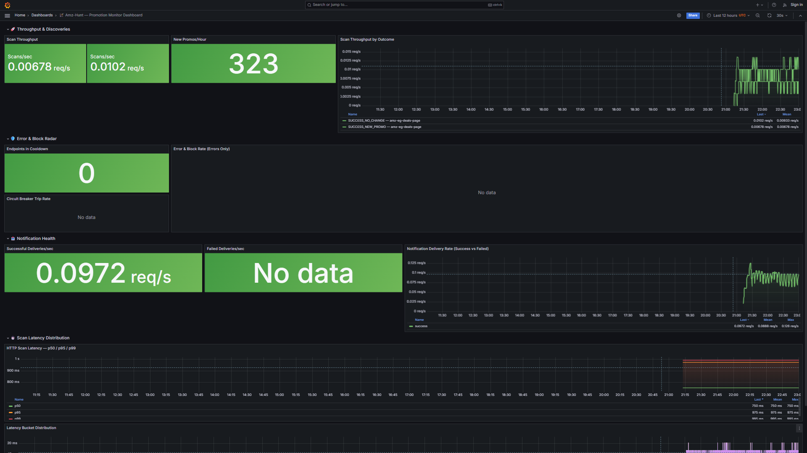
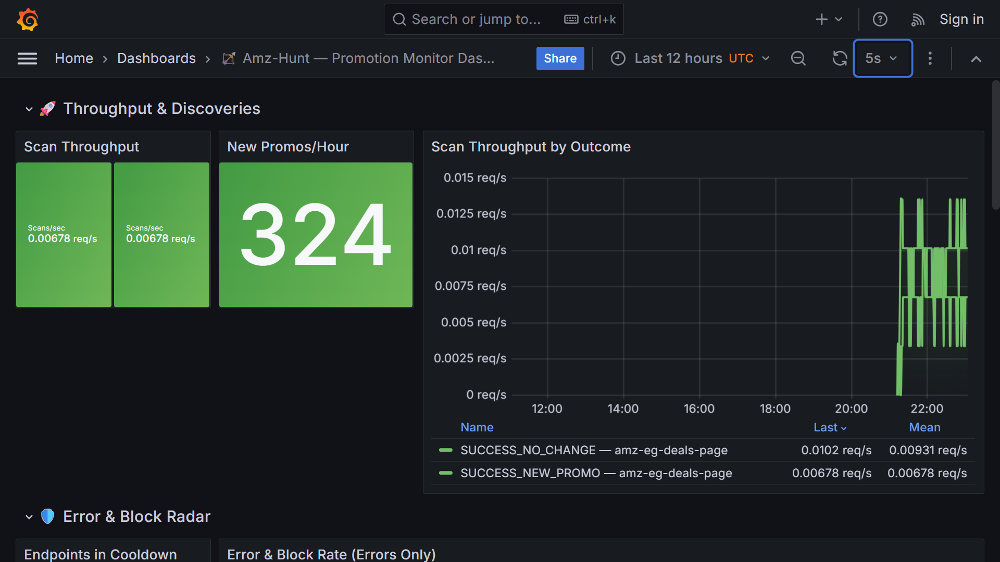
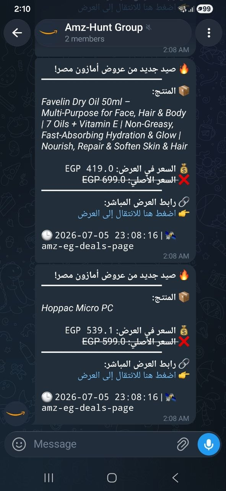
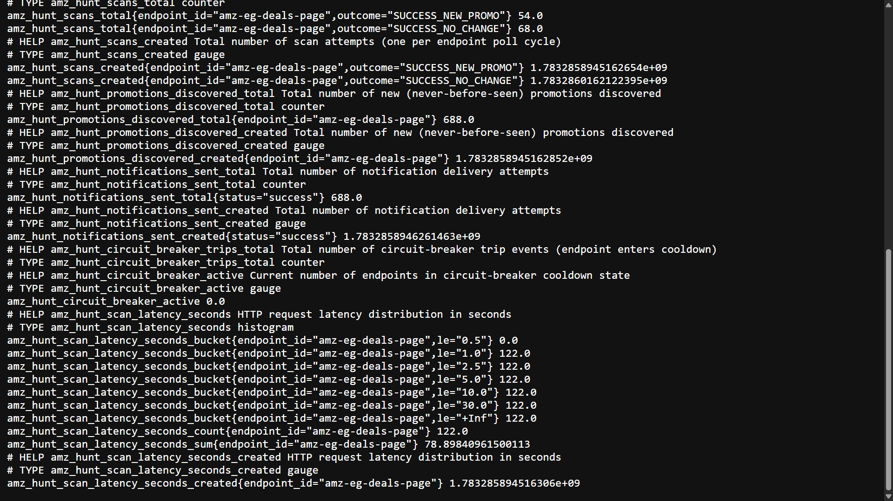

<!--
  ╔══════════════════════════════════════════════════════════════╗
  ║               🏹  AMZ-HUNT  — Portfolio Edition              ║
  ║     Amazon Egypt Promotion Monitor & Real-Time Alert System  ║
  ║          Zero-Budget · Anti-Bot · Hexagonal Architecture      ║
  ╚══════════════════════════════════════════════════════════════╝
-->
<div align="center">

# 🏹 AMZ-HUNT

### *Amazon Egypt Promotion Monitor & Real-Time Alert System*

[](https://www.python.org/downloads/)
[](https://opensource.org/licenses/MIT)
[](https://www.docker.com/)
[](https://en.wikipedia.org/wiki/Hexagonal_architecture_(software))
[](#-roadmap)
[](https://prometheus.io/)

</div>

---

<p align="center">
  <strong>💰 Zero-Budget &nbsp;|&nbsp; 🔐 TLS-Impersonated Anti-Bot &nbsp;|&nbsp; 🏛️ Hexagonal Architecture</strong><br>
  <em>Detect Amazon Egypt flash deals the instant they drop — no PA-API key, no cloud bill, no compromises.</em><br>
  <em>Engineered by a single developer. Production-grade from first principles.</em>
</p>

---

## 📋 Table of Contents

- [⚡ Quick Start (60 Seconds)](#-quick-start-60-seconds)
- [🎯 The Problem Amz-Hunt Solves](#-the-problem-amz-hunt-solves)
- [🧠 Architecture: Hexagonal by Design](#-architecture-hexagonal-by-design)
- [🔄 The 7-Phase Scan Pipeline](#-the-7-phase-scan-pipeline)
- [🔧 Tech Stack — Zero-Cost Stack](#-tech-stack--zero-cost-stack)
- [📂 Project Structure](#-project-structure)
- [⚙ Configuration](#-configuration)
- [🚀 Running the Monitor](#-running-the-monitor)
- [🐳 Docker Deployment](#-docker-deployment)
- [📊 Visual Monitoring Stack (Portfolio Showcase)](#-visual-monitoring-stack-portfolio-showcase)
- [📸 Portfolio Screenshots](#-portfolio-screenshots)
- [📈 Roadmap — All 7 Phases Complete ✅](#-roadmap--all-7-phases-complete-)
- [🤝 Contributing](#-contributing)
- [📄 License](#-license)

---

## ⚡ Quick Start (60 Seconds)

```bash
# 1. Clone
git clone https://github.com/Eng-Saeed-Ali/Amz-Hunt.git && cd Amz-Hunt

# 2. Configure
cp .env.example .env
# Edit .env → add your TELEGRAM_BOT_TOKEN & TELEGRAM_CHAT_ID

# 3. Launch the full stack (monitor + Prometheus + Grafana)
docker compose up -d --build

# 4. Open the dashboard
# Grafana → http://localhost:3000  (anonymous access, pre-loaded dashboard)
# Prometheus → http://localhost:9091
# Metrics raw → http://localhost:9090/metrics
```

> **No Docker?** `pip install -r requirements.txt && python -m scripts.seed_targets && python -m scripts.run_monitor`
>
> 💡 **Self-healing:** If you skip `seed_targets` and launch the monitor directly against an empty database, the system auto-detects the missing targets and seeds them automatically — no crash, no restart loop. Still, running `seed_targets` explicitly is recommended for visibility into exactly what endpoints are being registered.

---

## 🎯 The Problem Amz-Hunt Solves

Amazon Egypt (`amazon.eg`) runs flash promotions — steep discounts that appear without warning and disappear within hours. The **official Product Advertising API** requires 3+ qualifying sales before granting access — a classic chicken-and-egg problem for new affiliate marketers.

**Amz-Hunt bypasses this entirely** by polling Amazon's public deal pages with browser-identical TLS fingerprints, detecting new promotions in near-real-time, and pushing instant Telegram alerts — all for **$0/month**.

| Barrier | Conventional Solution | Amz-Hunt's Zero-Budget Approach |
|---------|----------------------|----------------------------------|
| No PA-API access | Wait 3+ months for qualifying sales | Direct HTML scraping + AJAX JSON endpoint probing |
| Amazon WAF blocks scripted clients | Rotate residential proxies ($50+/mo) | `curl_cffi` — TLS fingerprint impersonation as Chrome 124 (free) |
| Infrastructure costs | AWS/GCP VM ($20+/mo) | Single Docker container on a $5 VPS or free-tier Raspberry Pi |
| Arabic-English mixed content | Separate NLP pipeline | Bidirectional parser handles both languages natively |
| Duplicate alert fatigue | Manual dedup or external DB | SHA256 content fingerprinting with SQLite UNIQUE constraint |

---

## 🧠 Architecture: Hexagonal by Design

Amz-Hunt is built on **Hexagonal (Ports & Adapters)** architecture — the same pattern used by Netflix, TransferWise, and Alibaba for maintainable monoliths. The core domain (`src/core/`) has **zero direct imports from adapter modules**. Every external boundary (HTTP, Database, Notifications, Parsing) is defined as a Python Protocol — swappable without changing a single line of core logic.

```
                    ┌─────────────────────────────────────┐
                    │          ENTRY POINTS                │
                    │  run_monitor.py   seed_targets.py    │
                    └──────────┬──────────────────────────┘
                               │
                               ▼
                    ┌─────────────────────────────────────┐
                    │       COMPOSITION ROOT               │
                    │     src/core/di_container.py         │
                    │  (The ONLY module importing both      │
                    │   core Protocols AND adapter impls)   │
                    └──────────┬──────────────────────────┘
                               │
                 ┌─────────────┴─────────────┐
                 ▼                           ▼
    ┌──────────────────────┐    ┌──────────────────────────┐
    │   ADAPTER LAYER      │    │      CORE DOMAIN          │
    │                      │    │                            │
    │  CurlCffiClient ────►│◄───│  IHttpClient (Protocol)    │
    │  SQLiteBackend ─────►│◄───│  IStorageBackend           │
    │  TelegramNotifier ──►│◄───│  INotificationService      │
    │  HTMLDOMParser ─────►│◄───│  IParser                   │
    │  JSONEndpointParser ─►│◄───│                            │
    │                      │    │  ScanOrchestrator           │
    │  ⬅ imports core      │    │  (7-phase pipeline engine)  │
    │     Protocols only    │    │  Depends ONLY on Protocols  │
    │                      │    │  Zero adapter imports       │
    └──────────────────────┘    └──────────────────────────┘
```

**Why this matters for a portfolio piece:**

| Principle | How Amz-Hunt Demonstrates It |
|-----------|------------------------------|
| **Dependency Inversion** | Core depends on abstractions (Protocols), not concretions. Adapters depend on core abstractions. |
| **Single Responsibility** | Each adapter file does ONE thing: `telegram_bot.py` only sends Telegram messages, `curl_cffi_client.py` only makes HTTP requests. |
| **Open/Closed** | Add Discord notifications? Write `discord_webhook.py` implementing `INotificationService` — one new file, zero core changes. |
| **Testability** | Every Protocol can be mocked. Unit tests never hit Amazon or Telegram. Integration tests use saved HTML fixtures. |

> 📚 **Deep dive:** Read `Architecture_Blueprint.md` for the full 1563-line architectural specification — port definitions, entity catalog, circuit-breaker formulas, and anti-detection rationale.

---

## 🔄 The 7-Phase Scan Pipeline

Every polling cycle flows through a single orchestration method that catches **all** exceptions and maps them to typed `ScanOutcome` values. No unhandled exception ever escapes to crash the event loop.

```
                  ┌──────────────────────────────────────────────┐
                  │        ScanOrchestrator.poll_single()         │
                  │        (THE GLOBAL ERROR BOUNDARY)            │
                  └────────────────────┬─────────────────────────┘
                                       │
         ┌─────────────┬───────────────┼───────────────┬─────────────┐
         ▼             ▼               ▼               ▼             ▼
    ┌─────────┐  ┌─────────┐    ┌─────────────┐  ┌─────────┐  ┌──────────┐
    │Phase 1  │  │Phase 2  │    │  Phase 3    │  │Phase 4  │  │Phase 5/6 │
    │Schedule │─►│HTTP     │───►│  Parse &    │─►│Validate │─►│Dedup &   │
    │+ Jitter │  │Finger-  │    │  Extract    │  │+ Score  │  │Notify    │
    │         │  │print    │    │  Candidates │  │         │  │          │
    └─────────┘  └─────────┘    └─────────────┘  └─────────┘  └──────────┘
                     │                                              │
                     │  ┌──────────────────────┐                    │
                     └─►│  Circuit Breaker     │                    ▼
                        │  (per-endpoint       │            ┌──────────┐
                        │   exponential        │            │Phase 7   │
                        │   cooldown)          │            │Telemetry │
                        └──────────────────────┘            │→ SQLite  │
                                                            │→ Prometheus
                                                            └──────────┘
```

| Phase | Component | Key Engineering Detail |
|-------|-----------|----------------------|
| **1. Schedule** | `ActiveHoursScheduler` | Jittered intervals (±15s random) + time-of-day gate (active hours 08:00–02:00 Cairo) — makes polling patterns harder for Amazon ML to fingerprint |
| **2. Fetch** | `CurlCffiClient` | TLS 1.3 handshake replicates Chrome 124 exactly — JA3/JA4 fingerprint indistinguishable from a real browser. Header pool rotates User-Agent, Accept-Language, Sec-CH-UA per request |
| **3. Parse** | `HTMLDOMParser` / `JSONEndpointParser` | Strategy pattern — endpoint declares its `parser_type`, router dispatches to correct parser. BS4+lxml for HTML, `json.loads` for AJAX endpoints |
| **4. Validate** | `KeywordValidator` | Arabic keywords ("خصم", "عرض", "تخفيضات") + English ("deal", "coupon") + DOM pattern scoring → confidence threshold ≥ 0.6 |
| **5. Dedup** | `DedupEngine` | Two-layer dedup: SHA256 content fingerprint + Amazon's own `data-promo-id`. SQLite UNIQUE constraint as backstop |
| **6. Notify** | `NotificationQueue` | Async producer-consumer queue. Telegram Bot API with exponential backoff (250ms→500ms→1s→2s→4s), rate-limit-aware retry (honors `retry_after`) |
| **7. Log** | Telemetry system | Every outcome logged to SQLite `scan_log` + Prometheus Counter/Gauge/Histogram increment — zero external service dependency |

---

## 🔧 Tech Stack — Zero-Cost Stack

Every dependency is **MIT, BSD, or Apache 2.0** licensed. Zero copyleft, zero paid services, zero API subscriptions.

| Package | Role | Why This Package |
|---------|------|------------------|
| **`curl_cffi`** | TLS impersonation | Patches libcurl at C level to replicate Chrome/Firefox TLS handshakes. Standard `requests` broadcasts a Python TLS fingerprint that Amazon flags instantly |
| **`aiosqlite`** | Async database | Wraps stdlib `sqlite3` for non-blocking DB access — $0, no server process, WAL mode for concurrent reads |
| **`BeautifulSoup4` + `lxml`** | HTML parsing | Fast C-backed XML/HTML parser. Handles Amazon's idiosyncratic markup and Arabic UTF-8 content |
| **`pydantic-settings`** | Configuration | Type-safe `.env` loading with built-in validation — catches misconfiguration at startup, not 3AM |
| **`aiohttp`** | Telegram API client | Async HTTP session for Telegram Bot API calls with configurable timeout and connection pooling |
| **`prometheus_client`** | Observability | 6 metric families (Counter, Gauge, Histogram) — pure in-process, zero I/O overhead, daemon-thread HTTP exporter |

---

## 📂 Project Structure

```
Amz-Hunt/
│
├── src/
│   ├── core/                         # ═══ HEXAGONAL CORE (zero adapter imports) ═══
│   │   ├── ports/                    # Abstract Protocols: IHttpClient, IStorageBackend,
│   │   │   │                         #   INotificationService, IParser
│   │   │   ├── http_client.py
│   │   │   ├── storage.py
│   │   │   ├── notification.py
│   │   │   └── parser.py
│   │   ├── models/                   # Immutable dataclasses: Promotion, ScanResult,
│   │   │   │                         #   TargetEndpoint, HttpResponse, ParsedCandidate
│   │   │   ├── promotion.py
│   │   │   ├── target_endpoint.py
│   │   │   ├── scan_result.py
│   │   │   ├── http_models.py
│   │   │   ├── parsed_candidate.py
│   │   │   ├── notification.py
│   │   │   └── exceptions.py
│   │   ├── orchestrator.py           # 🧠 7-phase scan pipeline (the "brain")
│   │   ├── di_container.py           # 🔌 Composition root — assembles all adapters
│   │   ├── dedup_engine.py           # 🔍 SHA256 fingerprint + promo_id dedup
│   │   ├── validator.py              # ✅ Arabic/English keyword scoring
│   │   ├── parser_router.py          # 🔀 Strategy dispatcher → HTML or JSON parser
│   │   ├── scheduler.py              # ⏱️ Jittered intervals + active-hours gate
│   │   ├── notification_queue.py     # 📤 Async producer-consumer with retry/backoff
│   │   ├── metrics.py                # 📊 6 Prometheus metric families
│   │   └── shutdown.py               # 🛑 SIGINT/SIGTERM graceful teardown
│   │
│   ├── adapters/                     # ═══ ADAPTER LAYER ═══
│   │   ├── storage/
│   │   │   ├── sqlite_backend.py     # IStorageBackend → aiosqlite
│   │   │   └── migrations.py         # Idempotent schema DDL
│   │   ├── http/
│   │   │   ├── curl_cffi_client.py   # IHttpClient → curl_cffi (Chrome 124 TLS)
│   │   │   └── header_pool.py        # Rotating browser headers + Sec-CH-UA
│   │   ├── notification/
│   │   │   └── telegram_bot.py       # INotificationService → Telegram Bot API
│   │   └── parsers/
│   │       ├── html_dom_parser.py    # IParser → BS4 + lxml
│   │       └── json_endpoint_parser.py  # IParser → JSON path extraction
│   │
│   ├── config/
│   │   ├── settings.py               # pydantic-settings with field validators
│   │   ├── target_registry.py        # Curated Amazon EG endpoint catalog
│   │   └── constants.py              # Keyword lists, header templates
│   │
│   └── utils/
│       ├── fingerprint.py            # SHA256 hashing + HTML normalization
│       ├── retry.py                  # Exponential backoff with jitter
│       └── time_utils.py             # UTC helpers, active-hours calculations
│
├── scripts/
│   ├── run_monitor.py                # 🚀 Single entry point — `python -m scripts.run_monitor`
│   ├── seed_targets.py               # 🌱 Seed curated Amazon EG endpoints (idempotent)
│   ├── debug_dump_html.py            # 🔧 Fetch & save raw HTML for parser debugging
│   └── vps_healthcheck.sh            # 🩺 VPS health check script
│
├── prometheus/
│   └── prometheus.yml                # Scrape config — 5s intervals, amz-hunt job
│
├── grafana/
│   ├── dashboards/
│   │   └── amz-hunt.json             # 🖥️ Pre-built 10-panel enterprise dashboard
│   └── provisioning/
│       ├── dashboards/               # Auto-load dashboard on Grafana startup
│       └── datasources/              # Auto-configure Prometheus datasource
│
├── tests/
│   ├── unit/                         # Core logic tests with mocked adapters
│   └── integration/                  # Real adapters against saved HTML/JSON fixtures
│
├── docs/
│   └── images/                        # 📸 Portfolio screenshots directory
│
├── data/                             # SQLite DB (gitignored, bind-mounted in Docker)
├── Dockerfile                        # Multi-stage build — uv deps → slim production image (~180 MB)
├── docker-compose.yml                # Core monitor service
├── docker-compose.override.yml       # Prometheus + Grafana auto-merge
├── .dockerignore
├── .gitignore
├── .env.example                      # Environment template
├── deploy.sh                         # One-command VPS deployment script
├── requirements.txt                  # Pinned runtime dependencies
├── Agent_Handoff.md                  # AI agent continuity — 7-phase development log
├── Architecture_Blueprint.md         # 📘 Full architectural specification (1563 lines)
└── README.md                         # ← You are here
```

---

## ⚙ Configuration

All configuration is managed through `.env` (never committed) with Pydantic validation at startup:

```bash
# .env — copy from .env.example
TELEGRAM_BOT_TOKEN=123456:ABC-DEF1234ghijk    # From @BotFather
TELEGRAM_CHAT_ID=-1001234567890                # Your Telegram channel/group ID
DB_PATH=data/amz_hunt.db                       # SQLite database location
LOG_LEVEL=INFO                                  # DEBUG | INFO | WARNING | ERROR
DEFAULT_IMPERSONATE_PROFILE=chrome124           # curl_cffi TLS fingerprint target
SHUTDOWN_GRACE_PERIOD=10.0                      # Seconds to wait for in-flight tasks on shutdown
```

**Validation at startup:** If you set `DEFAULT_IMPERSONATE_PROFILE=chrome999`, the app fails immediately with a clear error message listing valid profiles — no silent fallback, no runtime surprises.

---

## 🚀 Running the Monitor

### Native Python

```bash
pip install -r requirements.txt
python -m scripts.seed_targets      # First time: seed default Amazon EG endpoints
python -m scripts.run_monitor        # Start infinite polling loop
```

> *(Note: The system now features an auto-seed guard, so simply running `python -m scripts.run_monitor` will automatically load default targets if you skip the seed step!)*

### What You'll See

```
[2026-07-05 10:00:01] [INFO    ] === Amz-Hunt Monitor Starting ===
[2026-07-05 10:00:02] [INFO    ] DI container built — all adapters wired
[2026-07-05 10:00:02] [INFO    ] Loaded 5 active TargetEndpoint(s)
[2026-07-05 10:00:02] [INFO    ] Prometheus metrics endpoint started on :9090
[2026-07-05 10:00:02] [INFO    ] Notification worker started
[2026-07-05 10:00:02] [INFO    ] Orchestrator polling loop started
[2026-07-05 10:00:04] [INFO    ] HTTP 200 | 48562 bytes | 2103ms | TLS=chrome124
[2026-07-05 10:00:05] [INFO    ] Parsed 14 candidate(s) → 3 NEW promotion(s)
[2026-07-05 10:00:05] [INFO    ] Scan complete: SUCCESS_NEW_PROMO — 3 alerts queued
[2026-07-05 10:00:05] [INFO    ] Next scan in ~52s
```

Press `Ctrl+C` for graceful shutdown — all in-flight tasks drain, DB closes cleanly, Telegram aiohttp session is released.

---

## 🐳 Docker Deployment

```bash
# Full stack (monitor + Prometheus + Grafana)
docker compose up -d --build

# Production-only (monitor alone)
docker compose -f docker-compose.yml up -d --build

# View logs
docker compose logs -f amz-hunt-monitor

# Graceful shutdown
docker compose down
```

**Production hardening included:**
- Multi-stage Dockerfile: `uv` for dependency resolution → slim runtime image (~180 MB)
- Non-root `appuser` (UID 1000)
- `HEALTHCHECK` via `pgrep -f run_monitor` every 60s
- `restart: unless-stopped` — survives host reboots
- Memory limit: 128 MB (configurable)
- `./data` bind-mounted for persistent SQLite storage across container rebuilds

---

## 📊 Visual Monitoring Stack (Portfolio Showcase)

Amz-Hunt ships with a **zero-cost, locally-hosted Prometheus + Grafana** observability stack — designed specifically to demonstrate enterprise-grade DevOps skills in your GitHub portfolio.

```
┌──────────────────────┐                   ┌──────────────────────┐
│  amz-hunt-monitor    │    scrape :9090   │     Prometheus       │
│  /metrics endpoint   │ ─────────────────►│     (port 9091)      │
│  6 metric families   │                   │  5-second intervals  │
└──────────────────────┘                   └──────────┬───────────┘
                                                      │ PromQL queries
                                                      ▼
                                             ┌──────────────────────┐
                                             │       Grafana        │
                                             │   (port 3000)        │
                                             │   Anonymous access   │
                                             │   10-panel dashboard │
                                             │   Auto-provisioned   │
                                             └──────────────────────┘
```

### 🔗 Access Points

| Service | URL | What You Get |
|---------|-----|--------------|
| **Grafana Dashboard** | `http://localhost:3000` | Pre-loaded 10-panel dashboard — no login, no setup |
| **Prometheus UI** | `http://localhost:9091` | Raw PromQL explorer, graph viewer, targets health |
| **Metrics Raw** | `http://localhost:9090/metrics` | Prometheus text exposition format (for debugging) |

### 📈 The 10-Panel Dashboard Breakdown

| Row | Panels | Metrics Visualized |
|-----|--------|--------------------|
| **🚀 Throughput & Discoveries** | Scan Throughput (Stat), New Promos/Hour (Stat), Throughput by Outcome (Time series) | `amz_hunt_scans_total`, `amz_hunt_promotions_discovered_total` |
| **🛡️ Error & Block Radar** | Endpoints in Cooldown (Stat), Error & Block Rate (Time series), Circuit Breaker Trip Rate (Bar chart) | `amz_hunt_circuit_breaker_active`, `amz_hunt_circuit_breaker_trips_total` |
| **📤 Notification Health** | Successful Deliveries/sec (Stat), Failed Deliveries/sec (Stat), Delivery Success vs Failed (Time series) | `amz_hunt_notifications_sent_total` |
| **⏱️ Scan Latency Distribution** | p50/p95/p99 Latency (Time series), Latency Bucket Distribution (Bar chart) | `amz_hunt_scan_latency_seconds` (Histogram with 0.5s–30s buckets) |

### 🧹 Stopping the Visual Stack

```bash
docker compose down          # Stop all containers, keep data volumes
docker compose down -v       # Tear down + wipe Prometheus TSDB (clean restart)
```

---

## 📸 Portfolio Screenshots

Place your screenshots in `docs/images/` and they'll render automatically when viewed on GitHub. Below are the recommended captures with placeholder references:

### 1. Grafana Dashboard — Full Overview



*The full 10-panel dashboard showing throughput, errors, circuit-breaker status, notification health, and latency distribution — all running on a $0 monitoring stack.*

### 2. Scan Throughput & Discoveries Panel



*Close-up of the throughput row: scans/sec rate, new promotions discovered per hour, and outcome breakdown by type.*

### 3. Telegram Alert Example



*A real alert delivered to Telegram — beautified Arabic HTML template with product title, deal price, list price with strikethrough, and direct Amazon link.*

### 4. Prometheus Metrics Raw



*The `/metrics` endpoint showing all 6 metric families in Prometheus text exposition format — the raw data feeding the Grafana dashboard.*

> **Screenshot tips:** Let the monitor run 10–15 minutes to build data density. Open Grafana at 1920×1080, press `F11` for full-screen. Use DevTools screenshot (`Ctrl+Shift+P` → "Capture full size screenshot") for pixel-perfect captures.

---

## 📈 Roadmap — All 7 Phases Complete ✅

| Phase | Engineering Goal | Key Deliverable | Status |
|-------|-----------------|-----------------|--------|
| **Phase 1** | Foundation | Settings, models, DB schema, project scaffold | ✅ |
| **Phase 2** | Full Wiring | DI container, all adapters wired, 7-phase pipeline operational | ✅ |
| **Phase 3** | Intelligence | Dedup engine, keyword validation, anti-bot jitter, graceful shutdown | ✅ |
| **Phase 4** | Containerization | Multi-stage Dockerfile, docker-compose, non-root user, healthcheck | ✅ |
| **Phase 5** | Resilience | Exponential backoff, circuit breaker, broken-link detection, per-endpoint cooldown, **self-healing startup (auto-seeds empty DB)** | ✅ |
| **Phase 6** | Observability | 6 Prometheus metric families, `/metrics` endpoint on :9090 | ✅ |
| **Phase 7** | Visual Monitoring | Prometheus + Grafana stack, 10-panel pre-provisioned dashboard | ✅ |

> 🎉 **Amz-Hunt is feature-complete.** Future work: multi-domain expansion (KSA, UAE), Discord/Slack notification adapters, web dashboard. The hexagonal architecture makes every extension a single-file addition.

---

## 🤝 Contributing

Amz-Hunt is an open-source portfolio piece — contributions that demonstrate architectural understanding are warmly welcomed.

1. **Fork** the repository
2. **Create a feature branch** (`git checkout -b feat/your-feature`)
3. **Follow the architecture:** Adapters implement Protocols in `src/core/ports/`. Core never imports adapter code directly. The DI container is the sole composition point.
4. **Test:** Run `python -m scripts.seed_targets && python -m scripts.run_monitor` — confirm nothing breaks
5. **PR** against `main` with a clear description

**High-impact contribution areas:**
- New parsers for additional Amazon domains (`amazon.sa`, `amazon.ae`)
- New notification adapters (Discord webhook, Slack, Email — implement `INotificationService`)
- Web dashboard for live scan statistics
- Additional Prometheus alerting rules

---

## 📄 License

MIT © [Saeed Ali](https://github.com/Eng-Saeed-Ali)

---

<p align="center">
  <sub>Engineered in Cairo 🇪🇬 • Zero budget, maximum craftsmanship • One developer, seven phases, no shortcuts</sub>
</p>